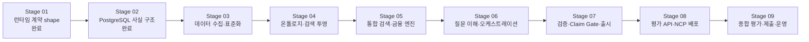

# Financial Product Agent 대회 제출 로드맵

**Status:** Approved baseline

**Approved:** 2026-08-20

**Terminal condition:** 대회 제출과 평가 운영 기간 종료

**Scope:** Stage 01 런타임 계약부터 Stage 09 평가 운영 종료까지의 현재 권위 있는 구현 순서와 단계별 완료 게이트

**Decision:** [ADR-0012: Use a Nine-Stage Competition Delivery Roadmap](decisions/ADR-0012-use-nine-stage-competition-delivery-roadmap.md)

## 1. 목적

이 문서는 현재 승인된 아키텍처와 데이터 기준을 실제 대회 제출까지 연결하는 전체 Stage 로드맵이다. 과거의 [2026-08-10 Core Implementation Plan](tasks/2026-08-10-financial-agent-core-implementation-plan.md)은 요구사항의 역사적 출처로만 유지하며, 그 문서의 DuckDB·로컬 인덱스·이전 Agent 구성을 실행 순서로 사용하지 않는다.

현재 로드맵은 다음을 전제로 한다.

- Stage 01 계약의 JSON shape와 Stage 02의 정규화 사실 저장구조는 동결 입력이다. 다만 공식 기준 변경으로 고정 cutoff literal과 DB CHECK만 [ADR-0017](decisions/ADR-0017-adopt-current-cutoff-with-legacy-preservation.md)에 따라 최소 보강해야 한다.
- 최종 organizer 기준은 `2026-08-24` 재배포본이며, 외부 공식자료는 `2026-08-24`까지 공개·이용 가능해진 자료만 사용한다. 각 사실의 실제 기준일은 그대로 보존한다. ([ADR-0016](decisions/ADR-0016-use-2026-08-24-organizer-baseline.md))
- 온톨로지는 13개 관계를 유지하고, exact organizer identity로 하나의 canonical 상품이 ETF와 펀드클래스 역할을 함께 가질 수 있도록 한다. 원천 행·sale LOT·내부 코드·구매가능 가정은 새 Graph 관계로 만들지 않는다. ([ADR-0018](decisions/ADR-0018-keep-minimal-ontology-with-canonical-multi-role-products.md))
- 주최 측 데이터가 평가 기준이며, 공식 외부 데이터는 주최 측에 없는 필드와 관계만 보완한다.
- 정상 경로의 LLM은 HyperCLOVA X Intent Resolver와 Answer Composer 두 역할로 제한한다.
- 필터·정렬·순위·집계·금융 계산·비교 가능성·유사도는 결정론적 코드가 수행한다.
- PostgreSQL이 수치·관계·근거의 권위 있는 원장이고, Fuseki와 pgvector는 검증 가능한 투영 또는 후보 검색 계층이다.
- 근거 없는 사실은 Claim Gate를 통과할 수 없다.
- 로드맵의 종점은 제출 직전이 아니라 공식 평가 운영 기간의 종료다.

## 2. 전체 흐름

결정론적 검색·계산 엔진과 LLM 기반 질문 오케스트레이션은 서로 다른 실패 원인과 검증 기준을 가지므로 Stage 05와 Stage 06으로 분리한다. 주최 측 데이터와 외부 공식 데이터는 동일한 컷오프·계보·활성화 규칙을 공유하므로 Stage 03 안에서 소스별 승인 게이트를 두고 함께 관리한다.

## 3. 공통 불변식

Stage 03부터 Stage 09까지 다음 조건을 계속 적용한다.

1. 평가용 사실의 게시일·이용 가능일은 `2026-08-24` 이후일 수 없고, 관측일·적용일·빈티지일은 원천의 실제 값을 보존한다.
2. 실제 기준일이 `2026-08-24`보다 이르면 cutoff 날짜로 바꾸지 않고 실제 날짜를 답변과 Evidence에 보존한다.
3. 원본 주최 측 파일, 공식 외부 원문, Parquet, 임베딩, 로컬 DB, 비밀정보는 Git에 커밋하지 않는다.
4. Graph 또는 Vector 결과는 PostgreSQL의 `dataset_version`, Source, Evidence 또는 관계 원장 ID로 돌아와야 사실을 지지할 수 있다.
5. LLM 출력은 실행 가능한 SQL·필터·계산식이나 최종 사실값의 권위가 될 수 없다.
6. 같은 요청·데이터 버전의 결정론적 결과와 출시 응답은 멱등적이어야 한다.
7. 단일 평가 요청 안의 여러 문장은 함께 해석하지만, 이전 평가 요청의 문맥에는 의존하지 않는다.
8. 사용자가 되물을 수 없는 대회 모드에서는 승인된 기본 규칙, 복수 후보, 제한 또는 답변 불가 중 하나로 끝낸다.
9. 각 Stage는 별도 상세 구현 계획, 사용자 승인, 집중 검증, 전체 회귀, 최종 diff·비밀정보·데이터 감사를 거쳐야 한다.
10. 직전 Stage의 완료 게이트를 통과하지 못한 상태에서 다음 Stage를 완료 처리하지 않는다.

## 4. Stage별 범위와 완료 게이트

### Stage 01 — 런타임 계약

**상태:** 구현·검증 완료, 동결

**목표:** 모든 런타임 단계가 주고받는 손실 없는 타입 계약을 고정한다.

**완료 산출물:**

- `RequestContext`, `QueryPlan`, `ExecutionGraph`, `ToolResult`
- `EvidenceBundle`, `VerificationReport`, `AnswerPlan`, `ReleasedAnswer`
- 태그 값 wire format과 생성 JSON Schema
- 교차 계약 검증과 Linux/amd64 컨테이너 검증

**완료 게이트:** [Stage 01 계획](tasks/2026-08-17-stage-01-runtime-contracts-implementation-plan.md)과 [STATUS](STATUS.md)에 기록된 동결 검증을 유지한다. 후속 Stage는 별도 계약이나 두 번째 값 코덱을 만들지 않는다.

### Stage 02 — PostgreSQL 저장 기반

**상태:** 핵심 저장·NCP 이식성·권한·성능 검증 완료

**목표:** 세 저장소 중 권위 있는 정형·근거·실행 원장을 구축한다.

**완료 산출물:**

- PostgreSQL 7개 논리 스키마와 Alembic `0001`~`0005`
- 상품·기관·증권·관계·관측값·문서·Vector 저장 경계
- Source·Evidence·Calculation·AtomicClaim·ClaimSupport 원장
- 불변 요청 산출물과 실행 생명주기
- `fa_migration`, `fa_build`, `fa_runtime` 최소 권한
- NCP PostgreSQL 마이그레이션·권한·합성 규모·핵심 SQL 검증

**완료 게이트:** [Stage 02 계획](tasks/2026-08-17-stage-02-postgresql-storage-implementation-plan.md)과 [STATUS](STATUS.md)에 기록된 NCP 검증을 유지한다. Stage 03은 임의 테이블이나 활성 데이터 직접 변경으로 이 저장 경계를 우회하지 않는다.

### Stage 03 — 데이터 수집·표준화

**목표:** 주최 측 4개 마스터와 승인된 공식 추가 데이터를 재현 가능한 하나의 평가 스냅샷 후보로 만든다.

**상세 기준:** [Stage 03 경량 데이터 수집·표준화 설계](specs/2026-08-20-stage-03-lean-data-ingestion-design.md), [ADR-0013](decisions/ADR-0013-use-lean-source-specific-ingestion.md)

**주요 범위:**

- 네 마스터의 전체 필드 프로파일링과 명시적 원천 매핑
- 상품·기관·기업·증권 식별자와 별칭 통합
- 결측·센티널·중복·단위·통화·날짜·상품군 의미 표준화
- 원본과 공식 문서를 Object Storage에 불변 보존하고 checksum·manifest 생성
- ETF 구성종목, 기업 지배·상장 관계, 동일일 가격·NAV·성과, 환율, 기관 마스터, 공식 상품·정책·위험 문서 등 질문 연결 P0 데이터 수집
- P1 데이터는 52개 질문의 지원 범위와 평가 가치가 확인될 때만 승인
- 문서의 상품 ID·문서 ID·페이지·절·부모 문맥을 보존한 청크 생성
- 모든 답변 가능 필드와 관계에 Source·Evidence 계보 연결
- PostgreSQL의 새 `building` 데이터 버전에 적재

**완료 게이트:**

- 네 마스터의 원본 행 수, 적재 행 수, 제외·중복·결측 사유가 대조된다.
- 내부 52개 회귀 질문과 공식 35문항 유형마다 `supported`, `limited`, `requires_data`, `unsupported`가 근거와 함께 확정된다.
- 핵심 P0 데이터는 적재되거나, 확보 불가 사유와 영향받는 질문이 명시된다.
- 컷오프 이후 처음 공개되거나 수정된 값이 평가 스냅샷 후보에 없다.
- 표준 ID 연결률, 충돌, 단위·통화·기준일과 원문 위치가 검증된다.
- Stage 03은 `building` 상태로 인계하며 Graph·Vector 준비 전 단독 활성화하지 않는다.

### Stage 04 — 온톨로지·Graph·Vector 투영

**목표:** 표준화된 데이터를 평가에서 요구하는 의미 관계와 서술 검색 구조로 투영하고 하나의 데이터 버전으로 활성화한다.

**주요 범위:**

- 필수 제출 TTL인 `common.ttl`, `bond_kr.ttl`, `etf_kr.ttl`, `etf_gl.ttl`, `fund_pub.ttl`
- 공통·상품군별 SHACL 제약
- 현재 승인된 최소 클래스와 13개 핵심 관계의 실제 필드 매핑
- PostgreSQL 관계 원장에서 RDF ABox와 Evidence named graph 생성
- Fuseki/TDB2 적재와 SPARQL 읽기 경로
- 허용된 임베딩 모델·버전 승인, 문서 임베딩과 pgvector 적재
- Keyword 검색을 위한 정규화 표현과 검색 투영
- PostgreSQL·Fuseki·Vector·근거 manifest 준비 상태 검증과 원자적 데이터 버전 활성화

**완료 게이트:**

- 52개 질문의 `required_relations`가 13개 관계, RelationAssertion 또는 PostgreSQL 관측값에 연결된다.
- TTL 파싱과 SHACL 검증이 통과하고 공식 제출 파일 구조가 존재한다.
- 모든 Graph edge가 `relation_assertion_id`, Evidence와 실제 유효일을 반환할 수 있다.
- PostgreSQL·Fuseki·Vector의 `dataset_version`과 manifest가 일치한다.
- 준비 상태가 하나라도 빠진 버전은 활성화되지 않는다.
- 활성화와 직전 검증 버전으로의 복구가 검증된다.

### Stage 05 — 통합 검색·금융 계산 엔진

**목표:** 검증된 실행 명령이 주어지면 LLM 없이 정확한 후보·관계·계산·Evidence를 반환한다.

**주요 범위:**

- SQL·SPARQL·Keyword·Vector 검색 어댑터와 federated retrieval
- 정확한 상품명·티커·ISIN·기업·기관 별칭 해소
- 상품군별 필터·정렬·순위·집계 Capability
- 수익률 정의·기간 정규화, 가격·NAV, AUM·환율 계산
- 상품군 간 비교 가능성 검사
- ETF·펀드·채권별 하드 필터와 결정론적 유사도 정책
- ETF 구성종목 가중 중첩과 `score_coverage`
- `closed_world_scope`가 없는 Graph 0건과 입증된 관계 부재 구분
- 모든 도구 결과의 Evidence 원장 결합

**완료 게이트:**

- 같은 입력과 데이터 버전에서 결과와 정렬 순서가 동일하다.
- 52개 질문의 도구 수준 필터·순위·계산 기대값이 통과한다.
- 기간·정의·통화·단위·모집단이 호환되지 않는 직접 비교는 차단 또는 분리된다.
- 유사도 `score_coverage < 60%`이면 숫자 순위를 출시하지 않는다.
- Graph·Vector 후보가 원장 Evidence에 결합되지 않으면 사실 결과가 되지 않는다.
- 대표 SQL·SPARQL·Keyword·Vector 경로의 NCP 지연이 요청 예산 안에 든다.

### Stage 06 — 질문 이해·오케스트레이션

**목표:** 여러 문장과 여러 조건이 결합된 질문을 타입 안전한 실행 그래프로 변환하고 필요한 Capability만 실행한다.

**주요 범위:**

- HyperCLOVA X Intent Resolver와 구조화 출력
- 전체 질문의 문장·의미 단위 분석과 엔티티 후보 생성
- `이 상품`, `그 운용사`, `위 상품들`의 타입 안전한 문맥 해소
- `RequestContext → QueryPlan → ExecutionGraph` 생성·교차 검증
- 중간 결과 바인딩과 선후 의존성 실행
- 필요한 Capability만 조건부 호출하고 독립 작업은 요청 내부에서 병렬 실행
- 재시도 예산, 55초 내부 마감, 실행 실패와 의미적 판정 분리
- `answer`, `partial`, `limitation`, `abstain` 계산
- 검증 전 `EvidenceBundle` 조립

**완료 게이트:**

- 골드 질문의 의도·하위 작업·의존성·라우팅이 기대값과 일치한다.
- 같은 질문 안의 지시어가 유일한 명시 엔티티 또는 선행 ToolResult 바인딩으로 해소된다.
- 필요 없는 Capability와 LLM 역할이 호출되지 않는다.
- 정상 경로의 계획 LLM 호출은 한 번이고 요청 전체 보정은 최대 한 번이다.
- 독립 하위 작업의 병렬성과 임계 경로 시간이 관측 가능하다.
- 단순·복합·교차 상품군·답변 불가 대표 질문이 EvidenceBundle까지 도달한다.

### Stage 07 — 근거 검증·Claim Gate·답변 출시

**목표:** 검증된 Claim만 정해진 표현 구조로 최종 응답에 출시한다.

**주요 범위:**

- Claim 유형별 결정론적 생성·표시 정책 등록부
- Evidence·Calculation·AtomicClaim·ClaimSupport 조립
- Verifier, CheckResult 규칙과 VerificationReport
- HyperCLOVA X Answer Composer의 구조화 `AnswerPlan`
- Stage 01에서 미룬 Claim Gate Registry와 template·column·block·slot 호환성 검사
- 사실값·날짜·단위·출처를 원장에서 렌더링하는 결정론적 Renderer
- `answer`, `retrieved_context`, 간결한 구조화 `think_trace`
- 검증된 응답 캐시와 재시도 일관성

**완료 게이트:**

- 근거 없는 사실 또는 검증 실패 Claim의 출시가 0건이다.
- 미등록 레이아웃 ID와 Claim·열·슬롯 비호환 조합이 모두 차단된다.
- Answer Composer가 새로운 사실값·수치·날짜·출처를 만들 수 없다.
- 제한·답변 불가 응답도 검증 가능한 이유와 사용하지 못한 데이터 범위를 가진다.
- 같은 요청·질문·데이터 버전의 출시 응답과 캐시 결과가 일치한다.
- `ReleasedAnswer`가 공식 평가 API의 다섯 문자열로 손실 없이 변환된다.

### Stage 08 — 평가 API·NCP 운영 배포

**목표:** 내부 Agent를 주최 측이 공개망에서 호출할 수 있는 운영 서비스로 만든다.

**주요 범위:**

- 공개 `GET /answer`와 정확한 query parameter·다섯 문자열 JSON 계약
- `/health/live`, `/health/ready`와 안전한 오류 응답
- Linux/amd64 Docker 이미지와 재현 가능한 배포
- HyperCLOVA X·임베딩·Object Storage 자격증명 관리
- Public Application Load Balancer와 Agent API 서버 2대
- PostgreSQL 최종 HA·자동 백업과 Fuseki Private Subnet 읽기 전용 배포
- Object Storage, 로그, 메트릭, 알림과 운영 대시보드
- PostgreSQL·Fuseki 백업 복구와 API 서버 장애 전환 훈련
- README의 제출 Endpoint와 운영 절차

**완료 게이트:**

- 외부 네트워크에서 인증 헤더 없이 공식 `/answer` 규격으로 호출된다.
- 알 수 없는 query parameter가 안전하게 처리되고 모든 응답 필드가 문자열이다.
- 같은 평가 요청의 최대 두 번 재시도가 외부 상태를 중복 변경하지 않는다.
- 공식 300초 타임아웃 전에 종료하며 내부 55초 하드 마감과 마지막 5초 안전 예산을 지킨다.
- API 서버 한 대 장애 시 서비스가 계속되고 준비되지 않은 데이터 버전은 노출되지 않는다.
- PostgreSQL·Fuseki 복구 훈련과 비밀정보·로그 노출 검사가 통과한다.

### Stage 09 — 종합 평가·제출 동결·평가 운영

**목표:** 전체 시스템을 공식 평가 조건으로 검증하고 제출을 동결한 뒤 평가 운영 기간 종료까지 가용성을 유지한다.

**주요 범위:**

- 52개 내부 골드 질문과 공식 약 30문항 구성에 맞춘 모의 평가
- 약 5개 의도적 답변 불가 유형과 결측·모호성·비교불가 집중 검증
- 정확도, Evidence 충족률, 라우팅, Claim Gate, p50·p95·최대 응답시간 측정
- 4초·7초·10초 목표와 55초 단계별 시간 예산의 실측 재조정
- 외부 재시도, 5xx, 네트워크 지연, API 서버 장애, DB·Graph 복구 훈련
- 기술제안서, 온톨로지 파일, README, Endpoint와 제출 체크리스트 검토
- 공식 제출 동결 이후 코드·데이터·배포 변경 중단
- 평가 기간 상태 모니터링과 허용된 장애 재기동 대응
- 평가 종료 후 최종 운영 증거와 사건 기록 정리

**최종 완료 게이트:**

- 필수 제출 파일과 Endpoint 제출이 완료된다.
- 전체 골드 세트에서 근거 없는 Claim 출시가 0건이다.
- 모든 실패 사례가 승인된 의미적 판정 또는 시스템 5xx 정책을 따른다.
- 정확도·Evidence·성능 결과와 시간 예산 변경 근거가 보존된다.
- 제출 동결 이후 결과물을 변경하지 않는다.
- 공식 평가 운영 기간 동안 Endpoint 가용성을 유지하고 운영 종료 기록을 남긴다.

## 5. 병렬 준비와 선후관계

- Stage 03의 소스 수집과 Stage 04의 TBox·SHACL 초안은 병렬 준비할 수 있지만, 실제 ABox와 최종 SHACL 검증은 Stage 03의 표준 ID·필드 매핑 이후에 수행한다.
- Stage 05의 검색·계산 코드는 합성 데이터로 먼저 개발할 수 있지만, 완료 판정은 Stage 04에서 활성화된 동일 데이터 버전으로 수행한다.
- Stage 08의 NCP 배포 문서·컨테이너·인프라 자동화는 앞당겨 준비할 수 있지만, 공개 서비스의 완료 판정은 Stage 07의 Claim Gate와 Renderer 이후다.
- 각 Stage 안에서도 독립 작업은 병렬화할 수 있지만, 단계 간 완료 게이트는 순차적으로 통과한다.

## 6. Stage 실행 절차

각 후속 Stage는 다음 절차를 반복한다.

1. 직전 Stage의 동결 산출물과 실측 결과를 재검토한다.
2. 해당 Stage에서 해결할 질문 유형, 입력 데이터, 비범위와 성공 기준을 명시한다.
3. 필요한 구현 대안과 트레이드오프를 제시하고 사용자 승인을 받는다.
4. 날짜가 포함된 상세 구현 계획을 `docs/planning/tasks/`에 작성한다.
5. 테스트 우선으로 작은 Task를 순차 구현하고 독립 검토 지적을 해소한다.
6. 집중 검증, 전체 회귀, 실제 NCP 게이트와 비밀정보·데이터·diff 감사를 통과한다.
7. 완료 증거를 [STATUS](STATUS.md)에 기록하고 다음 Stage 인계를 명시한다.

Stage 번호나 종점을 바꾸거나, 2개 제한 LLM 역할·3개 저장소·5개 논리 계층·Evidence 권위·Claim Gate 같은 승인된 상위 결정을 변경하려면 구현 전에 사용자 승인과 필요한 ADR을 추가한다.
