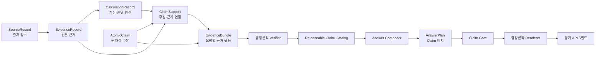
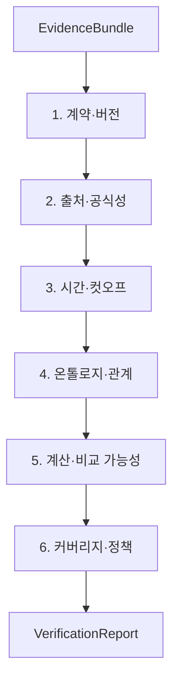

# Financial Product Agent 근거·검증·응답 출시 설계

**Status:** Task 2 승인 설계

**Date:** 2026-08-17

**Decision:** [ADR-0007: Use a Normalized Evidence Ledger and Structured Answer Plans](../decisions/ADR-0007-normalized-evidence-ledger-structured-answer-plan.md)

**Related:** [Runtime Contracts](RUNTIME_CONTRACTS.md), [Failure and Disposition Policy](FAILURE_AND_DISPOSITION_POLICY.md), [NCP Deployment Architecture](NCP_DEPLOYMENT_ARCHITECTURE.md), [Core Evaluation Set](../specs/core-evaluation-set.md), [Authoritative Data Requirements](../specs/authoritative-data-requirements.md)

> **Current-baseline notice:** Cutoff examples that use `2026-07-11` are superseded by the `2026-08-24` availability cutoff in [ADR-0016](../decisions/ADR-0016-use-2026-08-24-organizer-baseline.md). Claim-level actual dates remain unchanged.

## 1. 목적

이 설계는 검색된 데이터가 어떤 주장을 지지하는지, 계산된 값이 어떤 입력과 규칙에서 나왔는지, 최종 답변의 어떤 문장과 표 셀이 그 근거를 사용했는지를 끝까지 추적하는 구조를 정의한다.

핵심 문제는 JSON 형식이 맞는 답변과 금융적으로 맞는 답변이 다르다는 점이다. Answer Composer가 잘못된 수치를 쓰고 올바른 Claim ID를 붙이는 경우를 막으려면, 모델이 최종 사실 문자열을 작성하게 해서는 안 된다. 모델은 검증된 Claim의 배치만 계획하고, 값·날짜·단위·출처는 결정론적 Renderer가 출력한다.

## 2. 범위와 비범위

### 범위

- PostgreSQL `evidence` 스키마의 논리 근거 원장
- 직접값, 관계, 문서 구절, 검색 범위, 제외, 정책 근거
- 환산, 수익률, 순위, 집계, 유사도 계산 계보
- 원자적 Claim 생성과 지지 관계
- 결정론적 Verifier와 Claim Gate
- 구조화된 `AnswerPlan`과 응답 Renderer
- 평가 API의 `answer`, `retrieved_context`, `think_trace` 생성
- 52개 골드 질문 유형에 대한 근거·검증 수용 기준

### 비범위

- 물리 테이블 DDL과 인덱스 SQL
- Pydantic·JSON Schema 구현 코드
- HyperCLOVA X 프롬프트 문구
- 실제 외부 데이터 소스 활성화
- 원본 파일과 원본 API 응답의 Git 저장

## 3. 핵심 원칙

1. **PostgreSQL이 근거의 기준 원장이다.** Graph는 관계 탐색을 위한 투영본이고 Vector는 문서 후보 검색 수단이다.
2. **Claim은 원자적이다.** 하나의 Claim은 하나의 주체·속성·값 또는 관계와 필수 제한자만 담는다.
3. **Claim은 LLM이 생성하지 않는다.** Capability별 Claim 생성 규칙이 `ToolResult`에서 구조화 Claim을 만든다.
4. **원본과 계산을 구분한다.** 원화 환산 AUM은 AUM 근거, 환율 근거, 환산 계산을 모두 가져야 한다.
5. **부재 주장은 검색 실패와 다르다.** 완전성이 정의된 범위에서만 없음을 단정한다.
6. **Composer는 사실을 쓰지 않는다.** 승인된 Claim, 블록, 템플릿, 배치만 선택한다.
7. **Renderer가 출처를 만든다.** 출처명·날짜·필드·문서 위치를 LLM 출력에서 받지 않는다.
8. **컷오프는 주장 단위로 검사한다.** 실제 관측일과 게시·이용 가능일을 2026-07-11에 서로 다르게 적용한다.

## 4. 전체 흐름



RDB, Graph, Keyword, Vector는 서로 다른 `EvidenceRecord`를 생성할 수 있다. 그러나 검색 결과가 바로 Claim이 되지는 않는다. 안정된 식별자, 원문 위치, 시간, 단위, 출처가 결합된 뒤에만 Claim 생성 규칙의 입력이 된다.

## 5. PostgreSQL 근거 원장

### 5.1 `SourceRecord`

`SourceRecord`는 제공기관과 원본 자원을 한 번만 정의한다.

| 필드 | 의미 | 제약 |
| --- | --- | --- |
| `source_id` | 안정된 출처 ID | 변경 금지 |
| `publisher` | 주최측, 감독기관, 거래소, 운용사 등 | 정규화된 기관 ID와 연결 |
| `publisher_type` | 게시기관 유형 | 허용 Enum |
| `source_title` | 데이터셋·문서명 | 필수 |
| `source_type` | `dataset`, `api`, `document`, `filing` | 필수 |
| `authority_tier` | 출처 우선순위 | 주최측 → 공적기관 → 발행·운용·지수기관 |
| `source_locator_root` | URL, 문서 ID, Object key | 재현 가능 |
| `content_checksum` | 원본 무결성 | 원본 버전별 필수 |
| `license_or_usage_note` | 이용조건 | 알 수 있는 경우 필수 |
| `eligible_for_claim` | 최종 금융 주장 사용 가능 여부 | 검색 요약·블로그는 `false` |

보조 검색 출처는 원문 탐색을 위해 출처 메타데이터만 등록할 수 있지만 `eligible_for_claim=false`다. 이 출처는 `EvidenceRecord`나 `ClaimSupport`의 금융 사실 근거가 될 수 없다.

### 5.2 `EvidenceRecord`

`EvidenceRecord`는 주장 생성에 사용된 원본 단위다.

| 필드 | 의미 |
| --- | --- |
| `evidence_id` | 안정된 근거 ID |
| `evidence_kind` | `observation`, `relation`, `document_span`, `query_scope`, `exclusion`, `policy` |
| `source_id` | `SourceRecord` 참조 |
| `dataset_version` | 활성 데이터 버전 |
| `subject_id` | 상품·증권·기업·기관 등 주체 ID |
| `predicate_id` | 온톨로지 속성·관계 ID |
| `value_or_object_id` | 원본값 또는 대상 엔티티 ID |
| `normalized_value` | 표준화된 계산 입력값 |
| `unit`, `currency` | 단위와 통화 |
| `applicable_date` | 사실·값의 실제 적용일 |
| `valid_from`, `valid_to` | 관계·상태의 유효기간 |
| `published_at`, `available_at`, `vintage_date` | 게시·최초 이용·빈티지 시간 |
| `source_locator` | 시트·행·열, API key, 문서 페이지·절·구절 |
| `raw_value_repr` | 필요한 최소 원문 표현 |
| `parser_version`, `mapping_version` | 적재 계보 |
| `cutoff_status` | `eligible`, `after_cutoff`, `unknown_vintage`, `inapplicable` |
| `record_hash` | 핵심 필드의 결정론적 해시 |

`document_span`은 단독 청크 번호만 가지지 않고 문서 ID, 페이지, 절, 부모 문맥과 문장 범위를 가져야 한다. `query_scope`는 0건 결과를 입증할 때 검색 모집단, 적용 필터, 검색 경계, 완료 여부와 `scope_completeness=closed_world|bounded_unknown`을 보존한다.

### 5.3 `CalculationRecord`

| 필드 | 의미 |
| --- | --- |
| `calculation_id` | 안정된 계산 ID |
| `calculation_type` | `conversion`, `return`, `ranking`, `aggregation`, `comparison`, `similarity` |
| `formula_id`, `formula_version` | 승인된 수식·정책 버전 |
| `input_evidence_ids` | 직접 입력 근거 ID |
| `input_calculation_ids` | 선행 파생 계산 ID |
| `parameters` | 환율 종류, 순위 K, 비교 모집단 등 구조화 인자 |
| `population_definition` | 정렬·집계의 완전한 대상 집합 |
| `exclusion_evidence_ids` | 결측·비교 불가 등 제외 근거 |
| `tie_break_rule` | 안정 정렬을 위한 동률 규칙 |
| `result_value`, `unit`, `currency` | 계산 결과 |
| `rounding_rule` | 표시 전 반올림 규칙 |
| `calculation_hash` | 입력·수식·결과 해시 |

`input_evidence_ids`, `input_calculation_ids`, `exclusion_evidence_ids`는 논리적 컬렉션 표기다. 물리 DDL에서는 배열이나 중첩 JSON로 중복 저장하지 않고 순서와 역할을 가진 연결 테이블로 정규화한다.

순위 Claim은 해당 상품의 값 하나만으로 지지되지 않는다. 전체 비교 모집단, 제외, 동률 규칙이 포함된 `CalculationRecord`가 필수다.

### 5.4 `AtomicClaim`

| 필드 | 의미 |
| --- | --- |
| `claim_id` | 요청 내 안정된 Claim ID |
| `claim_type` | `direct_fact`, `relation`, `derived_metric`, `rank`, `similarity`, `no_match`, `data_limitation`, `policy_boundary` |
| `subtask_id` | 주장이 답하는 하위 작업 |
| `subject_id` | 주체 ID |
| `predicate_id` | 허용된 온톨로지 속성·관계 |
| `object_id` 또는 `value` | 하나의 대상 또는 값 |
| `unit`, `currency` | 값의 의미 |
| `qualifiers` | 기준일, 순위, 기간, 모집단, 비교 기준 |
| `display_policy_id` | 승인된 표시·단위·반올림 규칙 |
| `claim_hash` | 구조화 주장 해시 |

다음 문장은 세 Claim으로 나눈다.

```text
"ETF A는 삼성전자를 28% 편입하고 AUM은 8.2조원이다."

C1: ETF A holdsSecurity 삼성전자
C2: ETF A holdingWeight 삼성전자 = 28%
C3: ETF A AUM = 8.2조 KRW
```

### 5.5 `ClaimSupport`

`ClaimSupport`는 Claim과 직접 근거·계산을 다대다로 연결한다.

| 필드 | 의미 |
| --- | --- |
| `claim_id` | 지지받는 Claim |
| `support_kind` | `direct`, `calculation`, `scope`, `exclusion`, `policy` |
| `evidence_id` | 직접 근거 참조 |
| `calculation_id` | 계산 근거 참조 |
| `support_role` | 값, 식별, 입력, 비교 모집단, 제외, 제약 등 |
| `ordinal` | 표시·재현용 안정 순서 |

한 연결 행에서는 `evidence_id`와 `calculation_id` 중 정확히 하나만 설정한다. 이 배타 조건과 참조 무결성은 물리 DDL의 제약으로 강제한다.

파생 Claim은 `CalculationRecord`만 참조해도 되지만, 그 계산은 다시 모든 입력 `EvidenceRecord`까지 내려가야 한다.

### 5.6 `EvidenceBundle`

`EvidenceBundle`은 요청 하나의 검증 입력이다. 원본 데이터를 복사하지 않고 요청에 사용된 ID와 판정을 묶는다.

```text
EvidenceBundle
├─ bundle_id
├─ request_key
├─ dataset_version
├─ cutoff_date
├─ answered_subtasks
├─ unanswered_subtasks
├─ evidence_ids
├─ calculation_ids
├─ candidate_claim_ids
├─ exclusion_evidence_ids
├─ missing_data
├─ applied_defaults
├─ limitations
└─ bundle_hash
```

Bundle은 생성 후 수정하지 않는다. 참조 불일치를 복구해야 하면 기존 Bundle을 바꾸지 않고 새 Bundle ID와 해시를 만든다.

## 6. Claim 생성 등록부

각 Claim 유형은 등록된 생성 규칙과 필수 근거를 가져야 한다.

| Claim 유형 | 필수 근거 |
| --- | --- |
| `direct_fact` | 공식 원본 값·대상 식별자, 적용일 또는 유효기간, 단위(해당 시) |
| `relation` | 관계 인스턴스, 주체·대상 유형, 유효기간, 출처 |
| `derived_metric` | 승인 수식과 모든 입력 근거 |
| `rank` | 전체 모집단, 값, 제외, 정렬·동률 규칙 |
| `similarity` | 기준 상품, 하드 필터, 정책 버전, 축별 점수, 커버리지 |
| `no_match` | 완료된 조회 범위, 필터, 모집단 완전성 |
| `data_limitation` | 필수 데이터 정의, 확인한 범위, 누락·비교 불가 사유 |
| `policy_boundary` | 허용 어휘·정책·안전 규칙 ID와 버전 |

생성 등록부에 없는 Claim 유형은 LLM이 필요하다고 판단해도 만들 수 없다.

## 7. Verifier

Verifier는 `EvidenceBundle`을 수정하지 않고 순서가 고정된 검사를 수행한다.



### 7.1 공통 `CheckResult`

| 필드 | 의미 |
| --- | --- |
| `check_id` | 검사 ID |
| `target_type`, `target_id` | Claim, Evidence, Calculation, Subtask 중 검사 대상 |
| `rule_id`, `rule_version` | 적용 규칙 |
| `status` | `pass`, `fail`, `warning`, `not_applicable` |
| `reason_code` | 안정된 성공·실패 사유 |
| `related_evidence_ids` | 판정 근거 |
| `repairability` | `none`, `ledger_rebuild`, `llm_repair` |

### 7.2 검사 내용

1. **계약·버전:** ID 존재, 참조 무결성, 스키마, 단일 `dataset_version`, Bundle 해시를 검사한다.
2. **출처·공식성:** `eligible_for_claim`, 주최측 우선순위, 출처 충돌, 원문 위치를 검사한다.
3. **시간·컷오프:** `applicable_date`, `published_at`, `available_at`, `vintage_date`를 각각 2026-07-11 컷오프와 비교한다.
4. **온톨로지·관계:** 주체·대상 타입, 허용 predicate, 카디널리티, 관계 경로의 모든 edge 근거를 검사한다.
5. **계산·비교 가능성:** 입력·수식·결과를 재계산하고 기간, 의미, 단위, 통화, 모집단, 동률 규칙을 검사한다.
6. **커버리지·정책:** 하위 작업 중요도, 필수 Claim, 예측·단정적 추천·누락값 추정, 제한 표시를 검사한다.

`warning`은 중심 결론을 바꾸지 않는 정보에만 허용한다. 순위, 필터 통과 여부, 비교 가능성에 영향을 주면 Claim을 거부하고 답변 판정을 다시 계산한다.

### 7.3 관계 부재와 `closed_world_scope`

Graph 검색 0건은 관계 부재를 자동으로 의미하지 않는다. `RELATION_NOT_SUPPORTED`나 부재 Claim을 출시하려면 다음이 필요하다.

- 검색한 관계 유형과 주체·대상 모집단
- 데이터셋이 완전하다고 간주할 수 있는 범위와 버전
- 유효기간과 컷오프
- 완료된 조회를 입증하는 `query_scope` 근거

이 조건이 없으면 “없다”가 아니라 “승인된 데이터에서 확인할 수 없다”로 제한한다.

### 7.4 `VerificationReport`

```text
VerificationReport
├─ verification_status
├─ recommended_answer_disposition
├─ claim_checks
├─ calculation_checks
├─ subtask_coverage
├─ releaseable_claim_ids
├─ rejected_claims
├─ warnings
├─ disposition_reasons
└─ repair_actions
```

`verification_status=pass`는 판정과 주장을 안전하게 출시할 수 있다는 뜻이다. 따라서 검증된 `limitation`과 `abstain`도 `pass`일 수 있다. 최종 판정은 [Failure and Disposition Policy](FAILURE_AND_DISPOSITION_POLICY.md)의 순서를 따른다.

## 8. `AnswerPlan`

`AnswerPlan`은 기존 `AnswerDraft`의 정확한 설계명이다. 사실 문장 초안이 아니라 검증된 Claim을 답변 블록에 배치하는 구조화 계획이다.

```text
AnswerPlan
├─ schema_version
├─ request_key
├─ dataset_version
├─ verification_report_id
├─ answer_disposition
├─ renderer_profile_id
├─ blocks
│  ├─ block_type
│  ├─ template_id
│  ├─ claim_slots
│  ├─ columns
│  └─ rows
├─ source_display
└─ plan_hash
```

허용 블록은 `summary`, `fact_list`, `table`, `comparison`, `calculation`, `limitation`, `abstention`으로 제한한다. 템플릿과 열은 등록부의 ID로만 선택한다.

```json
{
  "answer_disposition": "answer",
  "blocks": [
    {
      "block_type": "summary",
      "template_id": "ranking.intro.v1",
      "claim_slots": {"ranking_basis": "C-RANK-BASIS-001"}
    },
    {
      "block_type": "table",
      "columns": ["rank", "product_name", "aum", "source"],
      "rows": [
        {
          "rank": "C-RANK-001",
          "product_name": "C-PRODUCT-001",
          "aum": "C-AUM-001"
        }
      ]
    }
  ],
  "source_display": "inline_numbered"
}
```

예시의 `source`는 행의 Claim들에서 Renderer가 생성하는 등록된 파생 열이다. 열 등록부는 Claim이 직접 채우는 열과 Renderer가 근거 연결에서 만드는 열을 구분하며, Composer는 어느 쪽에도 표시 문자열을 넣지 않는다.

Composer는 다음을 작성할 수 없다.

- 상품명, 수치, 날짜, 단위, 통화
- 출처명과 출처 번호
- 계산식과 계산 결과
- 임의의 사실 문장
- 등록되지 않은 Markdown·HTML·블록·열

`limitation`과 `abstain`은 Answer Composer를 호출하지 않고 Orchestrator가 검증된 사유 Claim으로 같은 `AnswerPlan` 계약을 만든다.

## 9. Claim Gate

Claim Gate는 자연어를 재해석하지 않고 `AnswerPlan`의 ID와 타입을 검사한다.

1. 모든 Claim ID가 `releaseable_claim_ids`에 존재하는가.
2. Claim 유형이 해당 블록·템플릿·열에 허용되는가.
3. 순위 행에 상품, 순위, 지표 Claim이 모두 있는가.
4. 모든 `critical` 출력 Claim이 배치되었는가.
5. `answer_disposition`이 `VerificationReport`와 일치하는가.
6. `partial`에 미완료 독립 요청과 한계 사유가 있는가.
7. `limitation`과 `abstain`이 검증된 사유 Claim만 사용하는가.
8. 등록되지 않은 블록·템플릿·열·표시 규칙이 없는가.
9. 같은 Claim을 서로 다른 의미로 사용하지 않았는가.
10. 질문이 요청한 K, 범위, 필드보다 많거나 적은 결과를 임의로 표시하지 않는가.

Claim Gate 실패는 [Failure and Disposition Policy](FAILURE_AND_DISPOSITION_POLICY.md)의 요청 전체 LLM 보정권을 사용할 수 있다. 보정권이 없거나 재실패하면 검증된 Claim을 질문 유형별 결정론적 템플릿에 배치한다. 후퇴 템플릿도 Claim Gate를 다시 통과해야 한다.

## 10. Renderer와 평가 API 출력

Renderer는 통과한 `AnswerPlan`과 근거 원장만으로 `ReleasedAnswer`를 만든다.

### 10.1 `answer`

- Claim의 `display_policy_id`로 숫자·단위·통화·날짜를 표시한다.
- 출처 번호는 본문 첫 등장 순서로 부여한다.
- 동일한 출처·원문 위치는 중복하지 않는다.
- 하나의 Claim에 여러 근거가 필요하면 `[1][2]`처럼 표시한다.
- 답변 하단에 제공기관, 데이터셋·문서명, 실제 기준일을 적는다.

### 10.2 `retrieved_context`

```text
[SOURCE-1]
관련 Claim: C-HOLDING-001
제공기관: 운용사
데이터: ETF 구성종목 내역
대상: ETF-KR-001
사용 필드: constituent_id, weight
적용일: 2026-07-10
게시일: 2026-07-10
원문 위치: 문서·레코드 식별자

[CALC-1]
관련 Claim: C-RANK-001
연산: AUM 내림차순 정렬
모집단: 편입 조건을 통과한 ETF
동률 처리: 상품 ID 오름차순
정책 버전: ranking.v1
```

실제 응답에 사용된 근거, 계산, 중대한 제외만 포함한다. 원본 표 전체나 문서 전체를 복사하지 않는다.

### 10.3 `think_trace`

```text
[의도] 삼성전자 편입 ETF의 AUM 상위 5개 조회
[경로] Graph 구성종목 관계 → RDB AUM 결합 → 순위 계산
[필터] ETF, 기준일 2026-07-11 이하
[계산] 동일 통화 AUM 내림차순, 동률 시 상품 ID 순
[제외] AUM 결측 상품
[한계] 구성종목과 AUM의 실제 관측일이 다름
```

`think_trace`는 `RequestContext`, `ExecutionGraph`, `ToolResult`, `VerificationReport`의 구조화 필드로부터 생성한다. 모델의 원시 Chain-of-Thought, 스택 트레이스, 인증정보를 포함하지 않는다.

### 10.4 출력 길이

공식 규격에 길이 제한이 없지만 지나치게 길면 초과분이 평가에 반영되지 않을 수 있다. 초기 설계에서 임의의 고정 문자 수로 핵심 근거를 잘라내지 않는다. 대신 다음 순서로 압축한다.

1. 사용하지 않은 근거 제외
2. 동일 출처·위치·날짜 중복 제거
3. 원문은 Claim을 입증하는 최소 구절만 표시
4. 중대한 제외와 한계 유지
5. 실제 평가 벤치마크로 출력 예산 조정

## 11. 저장과 변경 불가성

| PostgreSQL 스키마 | 저장 대상 |
| --- | --- |
| `evidence` | `source_record`, `evidence_record`, `calculation_record`, `atomic_claim`, `claim_support` |
| `operations` | Bundle, VerificationReport, AnswerPlan, ReleasedAnswer, 요청·오류·지연 메타데이터 |

원장 레코드는 `dataset_version`과 해시로 버전을 고정한다. 오류 정정은 기존 레코드를 조용히 덮어쓰지 않고 새 데이터 버전과 매핑 버전을 만든다.

Graph edge는 PostgreSQL `relation` 인스턴스 ID와 Evidence ID를 주석으로 가질 수 있다. 그러나 Graph 투영본이 손상되거나 재생성되어도 기준 근거 원장은 PostgreSQL에 남는다.

## 12. 예시 계보

### 12.1 ETF AUM 순위

```text
C-101: ETF-A holdsSecurity 삼성전자
└─ E-201: 운용사 공식 구성종목 레코드

C-102: ETF-A AUM = 8.2조 KRW
└─ E-202: 공식 AUM 레코드

C-103: ETF-A rankByAUM = 1
└─ CAL-301: AUM 내림차순 정렬
   ├─ E-202: ETF-A AUM
   ├─ E-203: ETF-B AUM
   └─ E-204: ETF-C AUM
```

### 12.2 원화 환산 AUM

```text
C-401: ETF-X convertedAUM = 12.3조 KRW
└─ CAL-401: USD AUM × USD/KRW
   ├─ E-401: 공식 USD AUM과 실제 기준일
   └─ E-402: 한국은행 환율과 실제 관측일
```

### 12.3 문서 설명 Claim

```text
C-501: 상품-P의 핵심 전략은 S이다
└─ E-501: 공식 문서 D, p.12, §3.2, 문장 범위 4-6
   ├─ published_at
   ├─ available_at
   └─ parent_context
```

### 12.4 0건과 관계 부재

```text
C-601: 조건에 맞는 ETF = 0건
└─ E-601: 완료된 query_scope + 적용 필터 + 조회 버전

관계 검색 0건
├─ closed_world_scope 있음  -> 부재 주장 가능
└─ closed_world_scope 없음  -> limitation / abstain
```

## 13. 테스트 전략

| 계층 | 검증 내용 |
| --- | --- |
| 계약 | 잘못된 ID, 누락 필드, 다른 데이터 버전 거부 |
| 출처 | 비공식 출처 거부, 주최측 데이터 우선 |
| 컷오프 | 2026-07-11 이후 게시·수정 데이터 거부 |
| Claim 생성 | 직접값·관계·순위·유사도·제한 Claim의 원자성 |
| 계산 재현 | 환산, 수익률, 순위, 집계, 동률 처리 |
| Verifier | `answer`, `partial`, `limitation`, `abstain`, 5xx 경계 |
| Claim Gate | 미승인 Claim, 잘못된 열, 필수 Claim 누락 차단 |
| Renderer | 숫자·단위·날짜, 출처 번호, 중복 제거, 5필드 문자열 |
| 종단간 | 52개 질문 유형의 라우팅부터 출시까지 |
| 장애 주입 | Composer 실패, 원장 불일치, 저장소 타임아웃, 템플릿 후퇴 |

추적 가능한 저장소에는 합성 픽스처와 규칙만 커밋한다. 주최측 원본으로 산출한 정답 행, Bundle, 응답 해시는 로컬의 추적 제외 산출물로 둔다.

## 14. 수용 기준

- 모든 사실 문장과 표 셀을 `Claim -> Evidence/Calculation -> Source`로 역추적할 수 있다.
- Composer가 생성한 상품명·수치·날짜·단위·출처 문자열은 출시될 수 없다.
- 순위·집계·환산·유사도 Claim에 승인된 계산 버전과 모든 입력 근거가 있다.
- 완전한 0건 조회와 실패한 조회가 다른 결과로 나온다.
- 부재 관계는 `closed_world_scope`를 검증하지 못하면 단정하지 않는다.
- 2026-07-11 이후 처음 게시·이용·수정된 근거가 평가 스냅샷에 들어가지 않는다.
- `answer`, `retrieved_context`, `think_trace`가 같은 Claim·계산·출처 원장에서 생성된다.
- 동일한 `request_key`와 `dataset_version`의 재시도는 캐시된 `ReleasedAnswer`가 있으면 동일한 응답을 반환한다.
- 근거·컷오프·Claim Gate 검사를 응답 속도 최적화를 이유로 생략하지 않는다.

## 15. 구현 전 남은 산출물

이 설계는 논리 계약을 확정한다. 구현 계획에서 다음을 새 파일 단위로 정의해야 한다.

1. Pydantic·JSON Schema의 정확한 타입과 Enum
2. PostgreSQL DDL, 외래키, 불변성 제약, 인덱스
3. Claim 유형별 생성기와 표시 정책 등록부
4. CheckResult 규칙 ID와 오류 코드
5. AnswerPlan 블록·템플릿·열 등록부
6. 합성 픽스처와 로컬 골드 정답 생성 절차
