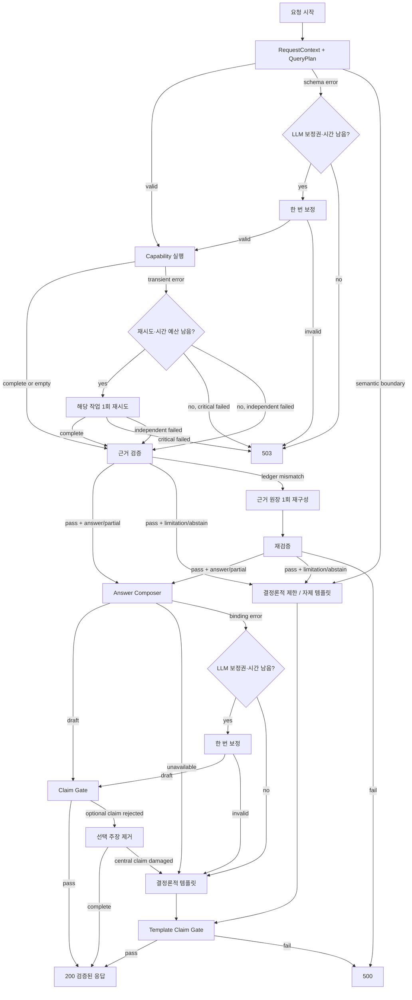

# Financial Product Agent 답변 판정과 실패 처리 정책

**Status:** Task 2 승인 기본안; 시간 예산은 실측 벤치마크 후 조정

**Date:** 2026-08-17

**Decision:** [ADR-0006: Separate Answer Disposition from Execution Failure and Bound Recovery](../decisions/ADR-0006-separate-disposition-and-bound-recovery.md)

**Related:** [Runtime Contracts](RUNTIME_CONTRACTS.md), [Evidence, Verification, and Rendering](EVIDENCE_VERIFICATION_AND_RENDERING.md), [Multi-Agent Architecture](MULTI_AGENT_ARCHITECTURE.md), [Official Evaluation API](../../reference/official-evaluation-api.md), [Core Evaluation Set](../specs/core-evaluation-set.md)

> **Current-baseline notice:** Product-existence and cutoff examples now use the `2026-08-24` baseline from [ADR-0016](../decisions/ADR-0016-use-2026-08-24-organizer-baseline.md); older literal dates below are historical examples.

## 1. 목적

이 정책은 질문에 답할 수 없는 이유와 서버가 요청을 처리하지 못한 이유를 분리한다. 존재하지 않는 상품, 공식 데이터 부재, 호환되지 않는 지표는 정상적인 금융 판정이다. DB 타임아웃, 모델 API 장애, 계약 불변식 훼손은 시스템 실패다. 두 종류를 같은 `abstain` 또는 같은 HTTP 코드로 처리하지 않는다.

대회 모드는 사용자에게 추가 질문을 보낼 수 없다. 모든 의미적 경계 상황은 한 번의 `200 OK` 안에서 답변, 부분 답변, 제한, 답변 자제 중 하나로 끝난다. 실행 장애만 주최측의 5xx 재시도 규칙을 사용한다.

## 2. 세 개의 독립 상태 축

```text
ExecutionOutcome
├─ completed
├─ completed_with_failures
└─ failed

VerificationStatus
├─ pass
└─ fail

AnswerDisposition
├─ answer
├─ partial
├─ limitation
└─ abstain
```

| 축 | 소유자 | 답하는 질문 |
| --- | --- | --- |
| `ExecutionOutcome` | Orchestrator | 실행 그래프가 끝났는가, 일부 작업이 실패했는가? |
| `VerificationStatus` | Verifier | 결과와 근거가 검증 규칙을 통과했는가? |
| `AnswerDisposition` | Orchestrator, Verifier의 판정을 사용 | 사용자의 요청을 얼마나 완성했는가? |

세 축은 서로 대체하지 않는다. 예를 들어 조건에 맞는 상품이 0개라는 사실을 완전히 조회·검증했다면 `completed + pass + answer`다. DB 장애로 조회를 시작하지 못했다면 `failed`이며 `abstain`으로 위장하지 않는다.

`VerificationStatus=pass`는 반드시 완전한 상품 답변을 뜻하지 않는다. `limitation`과 `abstain`도 그 판정 사유와 근거가 검증되었다면 `pass`다. `fail`은 현재 상태로는 안전한 응답을 출시할 수 없다는 뜻이다.

## 3. 하위 작업 중요도

Intent Resolver는 각 `QueryPlan.subtask`에 다음 중요도를 부여한다. Orchestrator는 이 값을 허용된 질문 유형과 작업 DAG로 다시 검증한다.

| 중요도 | 의미 | 실패 영향 |
| --- | --- | --- |
| `critical` | 질문의 중심 결론을 만드는 선행 작업 | `partial`로 축소 불가 |
| `required_independent` | 사용자가 별도로 요청했지만 중심 결론의 전제는 아닌 작업 | 중심 결론이 유지되면 `partial` 가능 |
| `optional` | 시스템이 추가하는 부가 설명·확장 | 생략해도 `answer` 유지 |

사용자가 명시적으로 요청한 결과를 단순히 `optional`로 낮춰서는 안 된다.

## 4. 답변 판정 규칙

### 4.1 `answer`

모든 `critical`과 `required_independent` 작업이 검증되었고 질문의 중심 결론을 손실 없이 제공한다.

다음도 `answer`다.

- 완전한 조회 결과가 0개인 경우
- 승인된 기본 해석 규칙을 적용하고 그 사실을 밝힌 경우
- 복수 후보를 후보별로 정확하게 답할 수 있는 경우
- 시스템이 스스로 추가한 `optional` 작업만 생략한 경우

### 4.2 `partial`

모든 `critical` 작업이 통과해 중심 결론은 정확하지만, 하나 이상의 `required_independent` 작업을 제공하지 못한다. 제공하는 부분만으로도 중심 결론이 왜곡되지 않아야 한다.

예:

- ETF AUM Top 5는 산출했지만 요청한 위험요인 문서 일부가 없다.
- 상품 기본정보와 수익률은 검증했지만 별도로 요청한 비용 정보 일부가 없다.
- 독립적인 두 목록 중 하나만 검증되었다.

### 4.3 `limitation`

질문과 대상은 유효하지만 데이터, 관계, 비교 기준이 부족해 중심 결론을 만들 수 없다. 어떤 정보가 필요한지와 어디까지 확인했는지를 설명할 수 있다.

예:

- ETF 구성종목이 없어 삼성전자 편입 ETF 순위를 만들 수 없다.
- 통화 환산 근거가 없어 통합 AUM 순위를 만들 수 없다.
- 수익률의 의미·기간·모집단을 호환되게 정규화할 수 없다.
- 일부 상품군이 빠진 상태로 전체 1위를 만들면 왜곡된다.

### 4.4 `abstain`

질문의 전제가 무효하거나, 허용 범위 밖이거나, 실질적인 금융 주장을 근거로 지지할 수 없다. 유사한 이름이나 LLM 일반지식으로 대체하지 않는다.

예:

- 온톨로지가 허용하지 않는 `AAAA` 신용등급
- 2026-07-11 기준 존재하지 않는 상품
- 공식 데이터로 입증할 수 없는 인물·상품 관계
- 미래 가격·수익률 예측
- 필수 투자자 정보가 없는 단정적 개인화 추천

## 5. 결정론적 판정 순서

Orchestrator는 수치형 신뢰도 점수나 LLM의 자유 판단으로 최종 상태를 고르지 않는다. 다음 순서를 적용한다.

```text
1. 중심 작업이 시스템 장애로 완료되지 않음
   -> AnswerDisposition 없음, 5xx

2. 전제·엔티티·관계가 무효하거나 금지된 요청
   -> abstain

3. critical 작업이 데이터·비교 한계로 완료되지 않음
   -> limitation

4. critical은 모두 통과했지만 required_independent 일부가 완료되지 않음
   -> partial

5. critical과 required_independent가 모두 통과
   -> answer
```

완전한 검색 결과가 0개인 경우는 5번에 해당한다. 조회를 끝내지 못해 0개처럼 보이는 경우는 1번이다.

## 6. 실패 분류

### 6.1 재시도하지 않는 의미적 경계

| 예시 코드 | 의미 |
| --- | --- |
| `NO_MATCH` | 완전한 조회 결과 0개 |
| `ENTITY_NOT_FOUND_AT_CUTOFF` | 컷오프 기준 엔티티 부재 |
| `RELATION_NOT_SUPPORTED` | 요청 관계 근거 부재 |
| `DATA_FIELD_MISSING` | 필수 필드 부재 |
| `METRIC_INCOMPATIBLE` | 승인된 비교·환산 불가 |
| `POLICY_PROHIBITED` | 예측·단정적 추천 등 금지 요청 |
| `AMBIGUITY_UNRESOLVED` | 기본값·복수 후보·분리 처리로도 해소 불가 |

### 6.2 실행 실패

| 분류 | 예시 | 재시도 | 최종 HTTP |
| --- | --- | --- | ---: |
| `transient` | DB·Graph·모델 타임아웃, 연결 오류, Rate Limit | 예산이 있으면 한 번 | 503 |
| `deadline` | 내부 55초 마감 초과 | 없음 | 504 |
| `internal_invariant` | 계약·데이터 버전·근거 불변식 반복 훼손 | 결정론적 재구성만 1회 | 500 |
| `planner_contract` | Intent Resolver 응답의 JSON Schema 오류 | 요청 전체 LLM 보정 1회 | 복구 불가 시 503 |
| `answer_contract` | `AnswerPlan` Schema 또는 Claim 바인딩 오류 | 남은 LLM 보정 또는 결정론적 템플릿 | 템플릿 불변식도 깨지면 500 |

5xx 응답은 가능하면 `application/json`과 공식 다섯 문자열 필드를 유지한다. `answer`에는 재시도 가능한 시스템 실패임을 간결히 나타내고, `think_trace`에는 비밀정보나 스택 트레이스 대신 단계·오류 코드만 넣는다. 5xx 본문은 `ReleasedAnswer`로 간주하거나 완성 답변으로 캐시하지 않는다.

## 7. 재시도 예산

| 예산 | 요청당 최대 | 사용처 |
| --- | ---: | --- |
| `llm_repair_budget` | 1 | 응답은 받았지만 `QueryPlan` 스키마 또는 `AnswerPlan` Claim 바인딩이 잘못된 경우 |
| `transient_retry_budget` | 2 | 응답을 받지 못한 모델·DB·Graph·외부 의존성 장애 |
| `same_operation_retry` | 1 | 같은 작업의 무한 반복 방지 |

- `llm_repair_budget`은 Intent Resolver와 Answer Composer가 공유한다. 한쪽에서 사용하면 다른 쪽에서 사용할 수 없다.
- `transient_retry_budget`은 모든 의존성이 공유하며, 같은 작업은 한 번만 재시도한다.
- 같은 오류 코드가 반복되면 다른 프롬프트나 도구로 무제한 우회하지 않는다.
- 남은 시간으로 후속 검증과 응답 전송 예산을 보장할 수 없으면 재시도하지 않는다.

근거 원장 재구성, 지원되지 않는 선택 문장 제거, 검증된 근거의 템플릿 렌더링은 LLM 재시도가 아니다. 단, 각 후퇴 경로는 한 번만 진입할 수 있는 비순환 상태 전이로 구현한다.

## 8. 단계별 실패 처리

### 8.1 Intent Resolver

- 스키마 오류는 남은 `llm_repair_budget`을 사용해 한 번 보정한다.
- 승인된 기본값으로 해소할 수 있는 모호성은 LLM 보정을 사용하지 않는다.
- 지원되지 않는 의도와 무효한 전제는 의미적 판정으로 끝낸다.
- 응답 미수신·타임아웃은 `transient_retry_budget`의 대상이다.

### 8.2 Capability Executor

- `empty`는 정상 완료다.
- 등록되지 않은 필드·연산·계산식은 재시도하지 않는다.
- 일시적 통신·저장소 오류만 재시도한다.
- `critical` 작업의 시스템 실패는 부분 데이터로 중심 결론을 만들지 않고 5xx로 전환한다.
- `required_independent` 작업만 실패했고 중심 결론이 검증되었다면 `partial`로 계속할 수 있다.

### 8.3 Verifier

- 데이터 부족과 비교 불가는 의미적 판정으로 반환한다.
- `ToolResult`와 근거 원장의 연결 불일치는 현재 결과로 한 번 재구성한다.
- 재구성 후에도 수치·단위·기준일·출처가 일치하지 않으면 `internal_invariant`다.
- LLM은 결정론적 검증 실패를 통과로 덮어쓸 수 없다.

### 8.4 Answer Composer와 Claim Gate

- 검증된 근거가 있다면 Composer 장애로 요청 전체를 실패시키지 않는다.
- 모델 응답 미수신은 예산이 있을 때만 일시적 재시도한다.
- Claim 바인딩 오류는 남은 LLM 보정권이 있을 때 한 번 보정한다.
- 복구하지 못하면 검증된 `releaseable_claim_ids`를 결정론적 템플릿으로 배치한다.
- Claim Gate가 선택적 부가 문장만 거부하면 그 문장을 제거하고 완전성을 다시 판정한다.
- 템플릿 답변도 Claim Gate를 통과해야 한다.

## 9. 전체 상태 전이



## 10. HTTP 응답 규칙

| 상황 | HTTP | `AnswerDisposition` |
| --- | ---: | --- |
| 모든 필수 결과 검증 완료 | 200 | `answer` |
| 중심 결론은 검증되었지만 독립 요청 일부 미완료 | 200 | `partial` |
| 데이터·관계·비교 기준 부족으로 중심 결론 불가 | 200 | `limitation` |
| 무효한 전제·엔티티 부재·금지 요청 | 200 | `abstain` |
| `critical` 실행의 일시적 장애가 내부 재시도 후에도 지속 | 503 | 없음 |
| 내부 하드 마감 초과 | 504 | 없음 |
| 계약·데이터 버전·근거 불변식 반복 훼손 | 500 | 없음 |

## 11. 초기 시간 예산

### 11.1 성능 목표

| 질문 경로 | 초기 p95 목표 |
| --- | ---: |
| 단순 조회·필터 | 4초 |
| 단일 상품군 분석 | 7초 |
| 복합·교차 질문 | 10초 |

이 값은 SLA가 아니라 성능 설계 목표다.

### 11.2 내부 하드 마감

| 경과 시간 | 마지막으로 완료해야 할 단계 |
| ---: | --- |
| 20초 | 질문 해석과 필요한 LLM 보정 |
| 40초 | Capability 실행 |
| 45초 | 근거·비교·정책 검증 |
| 50초 | 답변 작성과 Claim Gate |
| 55초 | JSON 직렬화와 응답 전송 |

이 시각은 각 단계에 고정적으로 할당한 시간이 아니라 최종 종료 시각이다. 앞 단계가 빨리 끝나면 남은 시간을 다음 단계가 사용할 수 있다. 50초 이후에는 새 LLM 호출이나 데이터 조회를 시작하지 않는다. 마지막 5초는 응답 안전 예산으로 보존한다.

## 12. 시간 예산 재조정 절차

시간 예산은 현재 아키텍처의 초기 값이다. 실제 HyperCLOVA X, PostgreSQL, Fuseki, NCP 네트워크 지연을 재지 않고 영구 상수로 간주하지 않는다.

### 12.1 측정 집합

- 현재 핵심 골드 질문 전체
- 단순, 단일 상품군, 복합·교차, 답변 불가 경로
- 정상, 부분, 제한, 답변 자제, 일시적 장애 주입 사례
- 냉간 시작 최소 1회와 온간 반복 최소 3회
- 최종 평가와 같은 NCP 리전·서버 사양·모델 종류

### 12.2 필수 측정값

- 전체와 단계별 p50, p95, p99, 최대 시간
- 모델·DB·Graph·Vector·검증 지연
- LLM 보정률과 일시적 재시도율
- 5xx·내부 마감 발생률
- 질문 유형별 정답률과 `AnswerDisposition` 분포
- 시간 중단 때문에 정확도가 바뀐 사례

### 12.3 조정 규칙

1. 먼저 프롬프트 크기, 후보 수, SQL·SPARQL 경로, 인덱스, 병렬성, 캐시를 조정한다.
2. 정상 지원 질문이 특정 단계 마감에 반복적으로 막히면 측정된 p99와 안전 여유를 근거로 단계 종료 시각을 조정한다.
3. 55초 안에서 단계 간 시간을 옮기는 변경은 벤치마크 보고서와 이 문서에 남긴다.
4. 55초 하드 마감, 재시도 횟수, HTTP 의미, 판정 순서를 바꾸려면 새로운 사용자 승인과 ADR이 필요하다.
5. 시간을 줄이기 위해 근거 검증, 컷오프 검사, Claim Gate를 생략하지 않는다.

## 13. 주최측 재시도와 멱등성

같은 요청이 5xx 후 다시 들어오면:

- `request_key`는 유지하고 `run_id`는 새로 만든다.
- 같은 `dataset_version`을 사용한다.
- 해시·버전·근거가 일치하는 검증된 `ToolResult`는 재사용할 수 있다.
- 실패했거나 검증되지 않은 결과는 완성 답변으로 재사용하지 않는다.
- 이전 요청의 대화 문맥을 새 질문 문맥으로 사용하지 않는다.
- 이미 완성된 `ReleasedAnswer`가 있고 응답 해시가 일치하면 그대로 반환할 수 있다.

## 14. 관측 필드

각 `FailureEvent`는 다음을 남긴다.

| 필드 | 의미 |
| --- | --- |
| `stage` | 실패한 단계 |
| `code` | 안정된 오류 코드 |
| `category` | `transient`, `deadline`, `internal_invariant`, `planner_contract`, `answer_contract` |
| `retryable` | 재시도 가능 여부 |
| `attempt` | 시도 번호 |
| `remaining_budget_ms` | 오류 시점의 남은 시간 |
| `duration_ms` | 실패한 시도의 소요 시간 |
| `dependency` | 영향받은 내부·외부 의존성 |

로그에는 원시 모델 사고과정, 인증정보, 전체 스택 트레이스, 원본 금융 데이터 행을 남기지 않는다.

## 15. 수용 기준

- 완전한 0건 조회가 `answer`로 나오고 실패한 조회가 0건처럼 보이지 않는다.
- `critical` 작업 실패를 `partial`로 낮춰 중심 결론을 만들지 않는다.
- 의미적 데이터 한계는 200, 실행 장애는 5xx로 분리된다.
- LLM 보정은 요청 전체에서 한 번만 사용한다.
- 일시적 재시도는 요청당 최대 두 번이며 같은 작업은 한 번만 재시도한다.
- 50초 이후에 새 LLM 호출·조회를 시작하지 않고 55초 안에 응답을 종료한다.
- 검증된 근거가 있으면 Composer 실패 후에도 템플릿 답변을 시도한다.
- 시간 예산 조정은 벤치마크 측정값과 정확도 영향을 함께 기록한다.
- 근거 검증, 컷오프 검사, Claim Gate를 시간 최적화 대상에서 제외하지 않는다.
