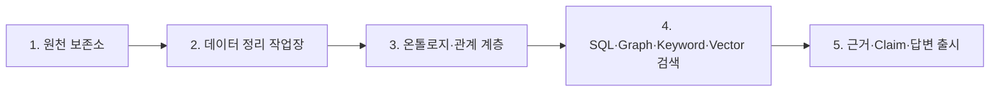

# 금융상품 Agent 최소 온톨로지 설계

**Status:** 2026-08-24 데이터 기준 승인안; TTL·SHACL 구현 대기

**Date:** 2026-08-25

**Cutoff:** `2026-08-24` under [ADR-0016](../decisions/ADR-0016-use-2026-08-24-organizer-baseline.md)

**Related:** [Core Evaluation Set](../specs/core-evaluation-set.md), [Authoritative Data Requirements](../specs/authoritative-data-requirements.md), [NCP Deployment Architecture](NCP_DEPLOYMENT_ARCHITECTURE.md), [Runtime Contracts](RUNTIME_CONTRACTS.md), [Evidence, Verification, and Rendering](EVIDENCE_VERIFICATION_AND_RENDERING.md)

## 1. 목적

이 온톨로지는 금융 용어 사전이나 LLM 프롬프트용 설명문이 아니다. 다음 런타임 작업을 통제하는 최소 의미 계층이다.

1. 질문에 등장한 상품·기업·증권·운용사·지수·테마를 정확한 유형으로 해소한다.
2. 질문의 관계 표현을 허용된 Graph 경로에 매핑한다.
3. 주체·관계·대상 유형, 카디널리티, 허용 값, 기준일을 검증한다.
4. SQL, Graph, Keyword, Vector 중 어떤 검색 역할을 사용할지 결정하는 근거를 제공한다.
5. 온톨로지와 근거로 입증할 수 없는 관계를 이름 유사도로 대체하지 않는다.

온톨로지의 클래스와 관계는 52개 평가 질문 유형, 주최 측 공식 예시, 주최 측 마스터 필드, 승인된 추가 데이터 요구사항을 입증하는 범위로만 유지한다.

## 2. 5개 논리 계층 안에서의 위치

온톨로지는 [3개 물리 저장소와 5개 논리 계층](NCP_DEPLOYMENT_ARCHITECTURE.md#11-3개-물리-저장소와-5개-논리-계층) 중 3계층이다.



- 2계층이 상품명, 운용사 코드, 종목 코드, 단위, 날짜를 통합한다.
- 3계층은 통합된 ID 사이의 의미 관계와 제약을 담당한다.
- 수치·시계열·계산의 기준 원장은 PostgreSQL이다. Graph에 수치를 복사하더라도 검색 편의를 위한 투영본일 뿐이다.
- Graph 결과는 PostgreSQL의 `relation_assertion_id`, `evidence_id`, `dataset_version`으로 되돌아와야 Claim을 지지할 수 있다.

## 3. 최소 클래스 구조

### 3.1 금융상품

```text
금융상품 FinancialProduct
├─ 국내채권 DomesticBond
├─ 상장지수상품 ExchangeTradedProduct
│  ├─ ETF
│  │  ├─ 국내ETF DomesticETF
│  │  └─ 해외ETF OverseasETF
│  └─ ETN
└─ 공모펀드 PublicFund
   ├─ 대표펀드 RepresentativeFund
   └─ 펀드클래스 FundShareClass
```

ETF와 ETN은 분리된 클래스이며 기본 검색에서 섞지 않는다. 대표펀드와 펀드클래스도 서로 다른 엔티티로 유지하여 AUM 중복 집계를 막는다.

상품군 클래스가 모두 상호 배타적인 것은 아니다. 주최 측 국내 ETF와
공모펀드 마스터에서 checksum-valid ISIN이 정확히 일치하는 상품은 별도
상품을 만들지 않고 하나의 canonical ID를 공유한다. 이 canonical 상품은
`DomesticETF`와 `FundShareClass` 역할을 동시에 가질 수 있다. 반면 `ETF`와
`ETN`처럼 경제적 구조가 양립할 수 없는 유형은 계속 상호 배타적이다.

원천 테이블에 함께 등장한다는 사실은 `owl:sameAs` 관계의 근거가 아니다.
정확한 organizer-authoritative 식별자 사전검사가 엔티티 생성보다 먼저
실행되어 중복 엔티티 자체를 만들지 않아야 한다.

### 3.2 조직·기업·증권

```text
조직 Organization
├─ 자산운용사 AssetManager
├─ 발행주체 Issuer
└─ 기업 Company

증권 Security
├─ 주식증권 EquitySecurity
└─ 채무증권 DebtSecurity
```

운용사, 발행주체, 기업은 업무상 같은 법인일 수는 있지만 관계의 역할이 다르므로 자동으로 하나의 유형으로 합치지 않는다. 하나의 조직 ID가 여러 역할 클래스를 동시에 가지는 것은 공식 근거가 있을 때만 허용한다.

### 3.3 투자 대상·분류·문서

| 클래스 | 한글 의미 | 주요 사용 |
| --- | --- | --- |
| `Index` | 기초·벤치마크 지수 | ETF·펀드 추종 지수, 지수 구성종목 |
| `Theme` | 테마 | 우주항공 등 공식 테마 관계 이력 |
| `Industry` | 산업·섹터 분류 | 반도체, 기업·증권 분류 |
| `Market` | 거래소·상장시장 | 상장 여부와 시장 확인 |
| `Region` | 투자지역 | 국가·지역 필터와 유사도 |
| `AssetClass` | 기초자산·자산군 | 주식·채권·원자재 등 구분 |
| `RiskGrade` | 승인된 위험등급 개념 | 허용된 등급 체계 검증 |
| `OfficialDocument` | 공식 문서 | 상품 구조·전략·위험·동향 근거 |
| `DocumentChunk` | 페이지·절에 묶인 문서 구간 | Keyword·Vector 후보와 Evidence 연결 |
| `RiskFactor` | 문서로 입증된 위험요인 | 위험 설명; 추론 생성 금지 |
| `RelationAssertion` | 기준일·출처를 가진 관계 주장 | Graph edge의 시간·근거 보존 |

`Currency`, `ReturnMetric`, `FeeMetric`, `AvailabilityStatus`는 제어 어휘로 정의하되, 실제 수치와 시계열은 PostgreSQL `observation`이 권위를 갖는다.

### 3.4 원천 레코드는 온톨로지 엔티티가 아니다

워크북 행, 국내채권의 시장·기준일·정보순번별 sale LOT, API 응답과 파일
locator는 PostgreSQL `SourceRecord`와 Evidence에 둔다. 하나의 상품에 여러
원천 레코드가 존재해도 상품 엔티티를 늘리거나 새 온톨로지 관계를 만들지
않는다.

```text
Canonical Product
├─ Observation A ─ Evidence → SourceRecord row 10
├─ Observation B ─ Evidence → SourceRecord row 11
└─ Relation       ─ Evidence → official source object
```

해석할 수 없는 내부 코드도 SourceRecord/Evidence에 원문으로 남긴다. 공식
코드표 없이 `Industry`, `Region`, `AssetClass`, `RiskGrade`로 승격하지 않는다.

## 4. 핵심 관계 13개

관계 수를 늘리는 것자체가 목표가 아니다. 아래 13개는 현재 평가 질문과 필수 근거 경로를 직접 지원하는 기본 관계다.

| ID | 한글 관계 | 주체 → 대상 | 용도·제약 |
| --- | --- | --- | --- |
| `managedBy` | 운용된다 | `FinancialProduct → AssetManager` | 특정 운용사 상품 검색. 기준일 현재 관계 필요 |
| `issuedBy` | 발행된다 | `FinancialProduct/ Security → Issuer` | 채권·증권 발행주체 식별 |
| `tracksIndex` | 지수를 추종한다 | `ETF/PublicFund → Index` | 동일·유사 추종지수 상품 탐색. 지수가 없는 상품에 강제하지 않음 |
| `holdsSecurity` | 증권을 편입한다 | `ETF/PublicFund → Security` | 편입비중·수량·기준일을 가진 `HoldingAssertion`으로 적격화 |
| `containsSecurity` | 지수에 포함된다 | `Index → Security` | 지수–종목–추종상품 다단계 경로 |
| `securityOfCompany` | 기업을 대표하는 증권이다 | `EquitySecurity → Company` | 기업명과 실제 편입 종목 ID 연결 |
| `controlsCompany` | 지배·종속 관계다 | `Company → Company` | 모회사–자회사. 자동 전이추론 금지, 각 edge의 공식 근거 필요 |
| `listedOn` | 해당 시장에 상장되어 있다 | `Security → Market` | 상장 자회사 조건. 상장상태 기준일 보존 |
| `classifiedAsIndustry` | 산업·섹터로 분류된다 | `Company/Security → Industry` | 반도체 등 공식 분류체계·버전 필요 |
| `associatedWithTheme` | 테마와 연결된다 | `FinancialProduct/Index/Company → Theme` | 최근 6개월 관계. `valid_from`, `valid_to`, `published_at`, `available_at` 필수 |
| `hasShareClass` | 클래스를 가진다 | `RepresentativeFund → FundShareClass` | 클래스별 비용·판매조건과 대표펀드 중복 방지 |
| `documentedBy` | 공식 문서로 설명된다 | `FinancialProduct/Organization → OfficialDocument` | 구조·전략·동향·상품 설명의 원문 연결 |
| `hasRiskFactor` | 위험요인을 가진다 | `FinancialProduct → RiskFactor` | 반드시 `OfficialDocument` 페이지·절·구절 Evidence로 지지 |

역관계는 질의 편의를 위해 OWL이나 질의 번역기에서 생성할 수 있지만, 별도 원천 사실로 카운트하지 않는다. 예를 들어 `managedBy`의 역관계인 “이 운용사가 이 상품을 운용한다”는 같은 관계다.

## 5. 관계 표현과 근거

단순 직접 edge만 저장하면 편입비중, 기준일, 출처, 유효기간을 잃을 수 있다. 따라서 질의용 직접 edge와 감사용 `RelationAssertion`을 함께 유지한다.

```text
ETF-A --holdsSecurity--> Security-Samsung

RelationAssertion-H001
├─ subject_id: ETF-A
├─ predicate_id: holdsSecurity
├─ object_id: Security-Samsung
├─ weight_pct: 27.4
├─ valid_from: 2026-08-21
├─ valid_to: null
├─ published_at: 2026-08-21
├─ available_at: 2026-08-21
├─ relation_assertion_id: relation-H001
├─ evidence_id: evidence-H001
└─ dataset_version: 2026-08-24-v1
```

모든 관계 Assertion에는 다음을 적용한다.

- `subject_id`, `predicate_id`, `object_id`는 같은 `dataset_version`의 유효한 ID여야 한다.
- `applicable_date`, `valid_from`, `published_at`, `available_at`, `vintage_date` 중 해당하는 날짜는 해당 dataset의 cutoff를 통과해야 하며, 현재 활성 후보는 `2026-08-24`다.
- Graph에서 검색된 edge는 `relation_assertion_id`와 `evidence_id`를 반환해야 한다.
- Graph 0건은 자동으로 “관계 없음”을 의미하지 않는다. 검색 모집단의 완전성이 정의된 `closed_world_scope`와 완료된 조회 근거가 있을 때만 부재 Claim을 만든다.

## 6. 평가 질문의 필수 경로

### 삼성전자 편입 ETF AUM Top 5

```text
Company
← securityOfCompany ← Security
← holdsSecurity ← ETF
→ PostgreSQL observation.AUM
→ 동일 단위·기준일 검증
→ 내림차순 Top 5
```

### 특정 운용사의 성과 1위와 유사상품

```text
AssetManager
← managedBy ← FinancialProduct
→ PostgreSQL 1년 역사적 누적수익률 비교
→ 1위 상품
→ 상품군별 유사도 정책
   ├─ tracksIndex
   ├─ holdsSecurity
   ├─ Region / AssetClass
   └─ 위험·구조 값
```

### 에코프로 상장 자회사 편입 ETF와 위험요인

```text
Company(EcoPro)
→ controlsCompany → SubsidiaryCompany
← securityOfCompany ← EquitySecurity
→ listedOn → Market
← holdsSecurity ← ETF
→ PostgreSQL AUM 순위
→ hasRiskFactor → RiskFactor
→ OfficialDocument 문서 구절 Evidence
```

### 최근 6개월 우주항공 테마 ETF

```text
Theme(우주항공)
← associatedWithTheme ← ETF / Index / Company
→ valid_from, valid_to, published_at, available_at
→ 컷오프 기준 최근 6개월 교집 검사
```

## 7. TTL·SHACL 파일 경계

공식 제출 구조와 상품군 경계를 따라 다음 파일을 사용한다.

```text
ontology/
├─ common.ttl
├─ bond_kr.ttl
├─ etf_kr.ttl
├─ etf_gl.ttl
├─ fund_pub.ttl
└─ shapes/
   ├─ common.shacl.ttl
   └─ domain.shacl.ttl
```

- `common.ttl`: 공통 클래스, 13개 핵심 관계, 구조적 공리, 역관계
- 상품군 TTL: 각 마스터 필드와 공통 개념의 매핑, 상품군별 용어·동의어
- `common.shacl.ttl`: ID, 도메인·레인지, 컷오프, 근거 ID 등 공통 제약
- `domain.shacl.ttl`: ETF/ETN 분리, 편입비중, 펀드 클래스, 채권 등급·만기 등 상품군 제약

실제 상품·기업·관계 인스턴스 ABox는 `dataset_version`별 named graph에 적재한다.

```text
urn:ontology:financial-product:v1
urn:data:financial-product:2026-08-24-v1
urn:evidence:financial-product:2026-08-24-v1
```

SHACL은 `DomesticETF`와 `FundShareClass`의 근거 있는 다중 typing을 허용하고,
`ETF`와 `ETN`의 동시 typing은 거부한다. 관계 Assertion은 PostgreSQL
`relation_assertion_id`, `evidence_id`, `dataset_version`으로 역추적되어야
한다.

## 8. 복잡도 제한

다음은 현재 온톨로지에 추가하지 않는다.

- 평가 질문이 사용하지 않는 세부 금융 상위 개념
- 대규모 공급망·인물·뉴스 그래프
- 근거 없는 테마·수혜주·관련주 추론
- 자동 추론된 기업 지배관계의 무제한 전이 폐쇄
- 수치 계산, 수익률 환산, AUM 순위, 유사도 가중치 연산을 OWL 규칙으로 실행하는 구조
- 별도 근거 없이 임베딩 유사도만으로 확정한 관계
- 워크북 행·sale LOT·source membership을 위한 별도 온톨로지 관계
- 공식 공지상 무효인 `BUYABLE_QUANTITY`를 이용한 구매 관계

새 평가 질문이 현재 13개 관계로 표현되지 않을 때만 다음 순서로 보강한다.

1. 새 관계가 아니라 기존 관계의 속성이나 중간 Assertion으로 표현 가능한지 검토한다.
2. 주최 측 데이터 또는 공식 추가 원천으로 관계를 입증할 수 있는지 확인한다.
3. 도메인, 레인지, 시간, 카디널리티, Evidence 조건을 함께 정의한다.
4. 기존 컴피텐시 질문과 SHACL 회귀 테스트를 통과한 뒤 버전을 올린다.

## 9. 구현 전 남은 검증

이 문서는 논리 기본안을 고정한다. TTL·SHACL 구현 계획은 다음을 다시 검증한 후 별도로 작성한다.

1. 52개 질문의 `required_relations` 전체가 13개 관계 또는 PostgreSQL 관측값 조회로 연결되는지
2. 승인된 280필드 매트릭스의 relation 필드가 13개 관계에 연결되고 observation·Evidence 필드가 Graph로 잘못 승격되지 않는지
3. ETF 구성종목, 기업 지배관계, 테마 이력, 공식 문서의 스냅샷을 2026-08-24 컷오프로 확보할 수 있는지
4. RDF 적재량과 SPARQL 경로의 NCP Fuseki 실측 지연이 응답 예산 안에 드는지
