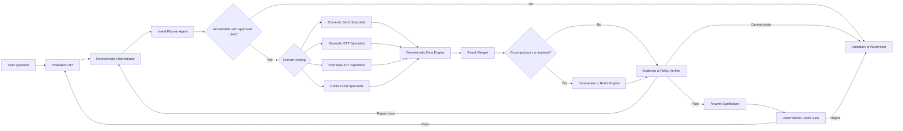

# Financial Product Agent Multi-Agent Architecture

**Status:** Approved design; official evaluation API contract incorporated 2026-08-12

**Date:** 2026-08-04

**Decision:** [ADR-0004: Use a Conditional-Parallel Multi-Agent Graph](../decisions/ADR-0004-conditional-parallel-multi-agent-graph.md)

**Competition-mode override:** The official API contract and the 2026-08-12 Harness revision supersede ADR-0004's follow-up clarification path for evaluation requests. ADR-0008 will record the complete single-turn fallback policy; the conditional-parallel architecture remains unchanged.

## 1. Objective

Build a fast, evidence-bounded financial-product Agent that understands natural-language questions, coordinates the necessary product expertise, performs reproducible data operations, and refuses to release unsupported answers.

The architecture must make multi-agent orchestration a measurable contributor to competition performance. It must not equate more Agent calls with better quality.

## 2. Design Principles

1. **Application code controls execution.** Agents interpret bounded tasks; the orchestrator schedules work and enforces budgets.
2. **Route conditionally and run independently.** Invoke only relevant product Specialists and run independent work concurrently.
3. **Pass typed state, not free-form instructions.** Every handoff uses a versioned schema and rejects invalid output.
4. **Keep financial logic deterministic.** Retrieval, filters, rankings, aggregates, and calculations run in tested services.
5. **Verify before composing.** The Synthesizer sees only an approved evidence bundle.
6. **Fail closed in one turn.** Missing evidence, incompatible metrics, repeated schema failure, or exhausted deadlines produce an approved fallback, limitation, partial result, or abstention without asking a follow-up question.
7. **Measure the graph.** Record per-stage latency, invoked agents, validation failures, repairs, tool-result hashes, evidence coverage, and final disposition without exposing hidden chain-of-thought.

## 3. System Graph

## 4. Component Boundaries

### 4.1 Evaluation API

**Responsibility:** Accept public `GET /answer`, validate the `question_id` and `question` query parameters, invoke the orchestrator, and return the five-field string-only JSON response required by the [official evaluation API specification](../../reference/official-evaluation-api.md).

**External contract:** Requests arrive sequentially, time out after 300 seconds, and may be retried up to twice after timeout or 5xx. The endpoint receives no authentication header or conversation history. It returns `question_id`, `question`, `retrieved_context`, `think_trace`, and `answer` as strings with `Content-Type: application/json`.

**Must not:** Interpret financial intent or fabricate a fallback answer after an internal failure.

### 4.2 Deterministic Orchestrator

**Responsibility:** Own graph state, route stages, dispatch parallel tasks, enforce time and concurrency budgets, validate contracts, and choose the final disposition.

**Inputs:** Original question, question ID, data-version identifier, request deadline.

**Outputs:** Verified answer, partial result with limitations, abstention, or controlled error. Competition mode never emits a follow-up question.

**Rules:**

- Only the orchestrator calls Agents and tools.
- Agent-to-Agent invocation is prohibited.
- A failed stage receives at most one repair attempt.
- The orchestrator does not reinterpret financial facts returned by the data engine.

### 4.3 Intent Planner Agent

**Responsibility:** Convert the question into a domain-neutral `QueryPlan` and identify critical ambiguity.

**Output highlights:** Product families, intent type, filters, metrics, periods, units, currencies, operations, result limit, ambiguity decision, selected fallback, and required Specialists.

**Integration choice:** Use HyperCLOVA X Structured Outputs for a schema-constrained plan. Because Structured Outputs cannot share a request with Function calling, the application validates the plan and performs dispatch itself.

### 4.4 Product Specialist Agents

| Specialist | Owns | Does not own |
| --- | --- | --- |
| Domestic Bond | Bond type, issuer, credit and risk grades, issue and maturity dates, coupon, duration, evaluated price, available yield fields | ETF or fund semantics, arithmetic, final wording |
| Domestic ETF | Asset class, region, risk grade, period returns, net assets, volume, distribution and pension eligibility, partial index and fee fields | Overseas-market conventions, arithmetic, final wording |
| Overseas ETF | Ticker, ISIN, exchange, trading currency, index, manager, total fee, English strategy, asset class, region, AUM, close and volume | Domestic eligibility rules, currency conversion, final wording |
| Public Fund | Fund attributes, benchmark, region, hedge status, period returns, net assets, risk grade and sale status | Missing fee inference, share-class aggregation without a verified key, final wording |

Each Specialist converts the common plan into a typed `DomainExecutionPlan`. It cannot execute arbitrary SQL, calculate a result, or write a user-facing answer.

### 4.5 Deterministic Data Engine

**Responsibility:** Validate permitted fields and operations, execute product retrieval and calculations, and return immutable results with provenance.

**Candidate implementation:** Immutable raw tables, normalized common registry, family detail tables, validated query plans, and SQL-backed tools. Semantic retrieval may supplement narrative fields but cannot override structured facts.

**Authoritative operations:** Exact lookup, filtering, sorting, Top-K, grouping, aggregation, date arithmetic, supported financial formulas, missingness classification, duplicate prevention, and availability checks.

### 4.6 Result Merger and Cross-Product Comparator

**Responsibility:** Combine independently returned family results and decide whether a requested comparison is valid.

**Compatibility dimensions:** Metric meaning, period, unit, currency, tax basis, price or return basis, risk-scale meaning, aggregation population, and data date.

**Allowed decisions:** Compare directly, normalize using an approved and disclosed method, show separate sections with limitations, or reject the comparison.

### 4.7 Evidence and Policy Verifier

**Deterministic checks:**

- Every returned value maps to an existing table, product ID, field, unit, and data date.
- Calculations reproduce from the bound inputs and formula.
- Filters and exclusions agree with the query plan.
- Missing and placeholder values were not silently converted to zero.
- Comparison compatibility decisions match the rules engine.

**Agent checks:**

- The proposed conclusion answers the user's stated intent.
- Limitations are visible and not contradicted elsewhere.
- The response does not introduce forecasts, definitive recommendations, or unsupported causal explanations.

The Agent verifier can request one repair but cannot overrule a deterministic failure.

### 4.8 Answer Synthesizer and Claim Gate

The Synthesizer receives only a verified `EvidenceBundle`. It formats the conclusion, comparison table, explanation, limitations, evidence summary, and concise execution trace.

Each factual statement must bind to one or more evidence IDs. The deterministic Claim Gate checks those bindings and rejects statements that reference missing, incompatible, or excluded evidence.

## 5. Typed Contracts

| Contract | Producer | Consumer | Required content |
| --- | --- | --- | --- |
| `QueryPlan` | Intent Planner | Orchestrator | Intent, domains, filters, metrics, periods, units, currencies, operations, limit, ambiguity, requested specialists |
| `DomainExecutionPlan` | Product Specialist | Data Engine | Table, permitted fields, predicates, order, grouping, calculations, missingness policy, expected evidence fields |
| `ToolResult` | Data Engine | Result Merger | Rows, calculated values, exclusions, warnings, source bindings, data version, result hash |
| `ComparisonDecision` | Comparator and rules engine | Verifier | Compatibility per dimension, normalization method, disclosures, rejected comparisons |
| `EvidenceBundle` | Evidence ledger and Verifier | Synthesizer | Verified facts, calculations, evidence IDs, exclusions, limitations, allowed conclusions |
| `AnswerDraft` | Synthesizer | Claim Gate | Structured sections and claim-to-evidence bindings |
| `VerificationReport` | Verifier or Claim Gate | Orchestrator | Pass or fail, deterministic failures, repairable issues, required disposition |

Contract schemas must be versioned. Unknown fields, missing required fields, invalid enums, and operations outside an allowlist are hard validation failures.

## 6. Execution Paths

### 6.1 Single-turn ambiguity path

Use when a missing condition materially changes the answer, such as an unspecified return period, currency basis, risk interpretation, or product boundary. Apply the registered default when one exists; otherwise return bounded alternatives with the basis disclosed, or stop with a limitation or abstention. Do not wait for another user turn.

### 6.2 Fast path

Use for exact product lookup and simple supported filters:

`Planner → one Specialist → Data Engine → deterministic verification → Synthesizer → Claim Gate`

Skip the Comparator and nonessential Agent verification when deterministic checks establish the answer completely.

### 6.3 Single-family analytical path

Use for ranking, aggregation, or calculations within one product family:

`Planner → one Specialist → Data Engine → Verifier → Synthesizer → Claim Gate`

### 6.4 Cross-product path

Use for questions spanning multiple product families:

`Planner → relevant Specialists in parallel → Data Engine tasks in parallel → Merger → Comparator → Verifier → Synthesizer → Claim Gate`

## 7. Failure Handling

| Failure | Response |
| --- | --- |
| Planner output fails schema validation | One constrained internal repair; then controlled limitation or inability response |
| Planner omits a materially required condition | Apply an approved fallback; otherwise return a limitation or abstention before retrieval |
| One Specialist fails while its domain is required | Retry that Specialist once; otherwise abstain or return a clearly labeled partial result only if the question can still be answered |
| Data Engine rejects a field, operation, or calculation | Do not let an Agent rewrite the result; return limitation or controlled error |
| Comparison is incompatible | Separate results, disclose an approved normalization, return a limitation, or reject the comparison |
| Evidence is missing or inconsistent | One repair using the existing tool results; no new unsupported facts |
| Claim Gate finds an unsupported statement | Remove it only if the answer remains complete; otherwise return to one repair or abstain |
| Deadline is nearly exhausted | Stop optional stages and return the safest complete disposition available; never release an unverified draft |
| Provider quota or transient API failure | Bounded retry with jitter only when the request deadline permits; record the failure stage |

## 8. Latency Strategy

- Invoke only the Specialists named by the validated plan.
- The organizer sends no concurrent evaluation requests, but independent work inside one request may still run concurrently.
- Run independent Specialist and data-engine tasks concurrently.
- Keep Agent inputs to the minimum contract and relevant schema slice.
- Cache static schema summaries, field mappings, prompt versions, and safe query plans.
- Do not run debate, voting, or duplicate answer generation on the critical path.
- Bound every model call by token, time, and repair budgets.
- Reserve time inside the 300-second external timeout for JSON serialization and network delivery; internal targets remain much lower than the external maximum.
- Return one complete JSON object after verification. The official contract does not define streaming or progress events.

### Initial targets

| Query path | Provisional p95 target |
| --- | ---: |
| Simple supported lookup or filter | 4 seconds |
| Supported single-family analysis | 7 seconds |
| Supported cross-product analysis | 10 seconds |

These are design targets, not an SLA. Benchmark measured HyperCLOVA X, database, deployment-region, cold-start, and concurrency latency before freezing them.

## 9. Verification Strategy

### Contract tests

- Valid and invalid examples for every schema.
- Unknown-field, missing-field, invalid-enum, and disallowed-operation rejection.
- Contract-version compatibility tests.

### Deterministic engine tests

- Exact filter, sort, Top-K, aggregation, date, missingness, and duplicate-handling cases.
- Redundant calculation checks against independently prepared expected values.

### Agent tests

- Planner intent and routing gold set.
- Product Specialist mapping gold set for each family.
- Ambiguity, default-selection, limitation, and abstention cases without a second request.
- Prompt-injection and unsupported-field attempts.

### End-to-end evaluation

- Supported lookup, multi-filter, ranking, aggregation, evidence explanation, and cross-family cases.
- Unsupported forecasts and definitive recommendation prompts.
- Incompatible period, unit, currency, tax basis, and aggregation cases.
- Missing data, placeholders, duplicate share classes, and unavailable-product conditions.

### Failure and performance tests

- Inject Agent timeouts, invalid JSON, empty results, partial provider failures, and verifier rejections.
- Verify repeated `question_id` and `question` requests are idempotent and do not reuse prior-question context.
- Measure stage-level p50, p95, and p99 latency, model tokens, parallelism, retries, and cache hits.
- Compare the graph against a one-Agent baseline to prove that added Agents improve evaluated correctness or latency.

## 10. Success Gates

- Gold-set deterministic calculations match exactly.
- All benchmark factual claims have valid evidence bindings.
- No unsupported factual claim passes the Claim Gate in the benchmark suite.
- Incompatible comparisons never appear as undisclosed direct rankings or aggregates.
- Ambiguous and unavailable-data cases take the expected fallback, limitation, or abstention path without a follow-up turn.
- Router tests invoke all required Specialists and no irrelevant Specialists.
- Cross-product independent work is observable as concurrent, not sequential.
- Provisional p95 latency targets are measured and either met or explicitly revised before submission.

## 11. Open Implementation Decisions

The architecture is approved, but the following implementation choices require separate evaluation or ADRs:

- orchestration library or custom state-machine implementation;
- physical database and indexing engine;
- semantic retrieval and embedding model, if any;
- exact contract schemas and versioning mechanism;
- deployment topology, concurrency limits, caches, and provider quota policy;
- benchmark dataset construction and accepted latency SLA.

## 12. References

- [CLOVA Studio Structured Outputs](https://api.ncloud-docs.com/docs/en/clovastudio-chatcompletionsv3-so)
- [CLOVA Studio Function calling](https://api.ncloud-docs.com/docs/en/clovastudio-chatcompletionsv3-fc)
- [Mirae Asset AI Festival official FAQ](https://miraeassetfesta.com/notice)
- [Official Evaluation API Specification](../../reference/official-evaluation-api.md)
