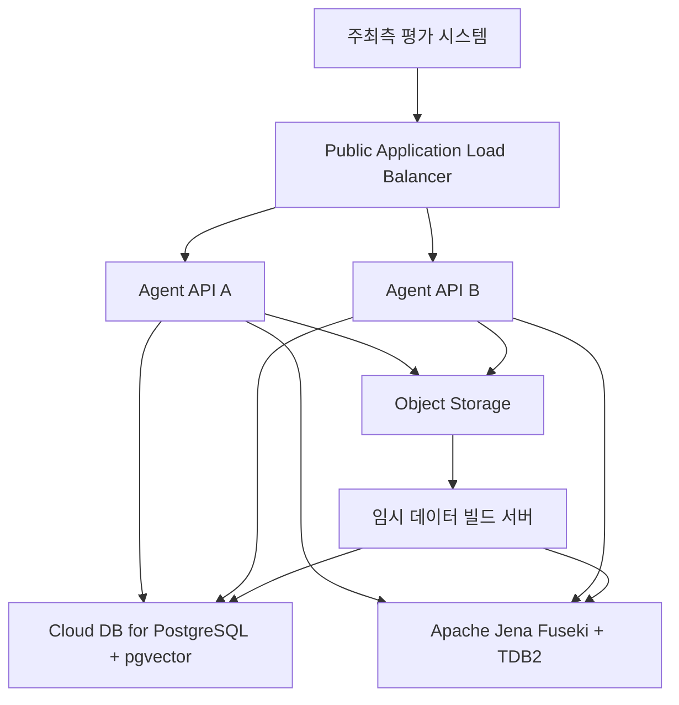
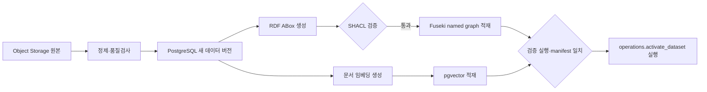

# Naver Cloud 배포 아키텍처와 초기 사양

**Status:** Task 2에서 승인된 배포 기준; 실제 프로비저닝 전 부하 테스트로 1회 재검증

**Date:** 2026-08-17

**Scope:** Naver Cloud Platform의 저장소 배치, 서버 사양, 네트워크, 백업, 모니터링 기준

**Related:** [공식 평가 API 규격](../../reference/official-evaluation-api.md), [Evidence, Verification, and Rendering](EVIDENCE_VERIFICATION_AND_RENDERING.md), [Stage 01 Runtime Contracts 구현 계획](../tasks/2026-08-17-stage-01-runtime-contracts-implementation-plan.md), [Stage 02 PostgreSQL Storage 구현 계획](../tasks/2026-08-17-stage-02-postgresql-storage-implementation-plan.md)

이 문서는 금융상품 Agent를 Naver Cloud Platform에 배포할 때 사용할 인프라 기준을 기록한다. 금융 데이터는 계속 **2026-07-11**을 컷오프로 사용한다. 인프라 제품과 소프트웨어 버전은 실제 배포 시점에 NCP가 지원하는 안정 버전을 사용하되, 금융 데이터 기준일을 바꾸지 않는다.

폐기된 2026-08-10 구현 계획의 DuckDB·로컬 인덱스는 이 결정 이전의 제안이다. 새 단계별 구현 계획은 이 문서를 NCP 기준으로 사용하며, 기존 계획이나 ADR을 소급해서 덮어쓰지 않는다.

## 1. 결정 요약

초기 운영 구조는 다음 네 저장·실행 구성요소를 사용한다. 데이터 저장소만 세면 **Object Storage, PostgreSQL, Fuseki의 3개 물리 구성**이고, Agent API는 이 세 저장소를 사용하는 실행 구성요소다.

1. **Object Storage:** 원본 파일, 공식 문서, 정제 산출물, 백업
2. **Cloud DB for PostgreSQL:** 표준 상품 데이터, 관측값, 관계 원장, 문서 청크, `pgvector`, 근거와 실행 기록
3. **Apache Jena Fuseki/TDB2:** TTL·SHACL 온톨로지와 실제 RDF 지식 그래프
4. **Agent API Server:** 질문 해석, 결정론적 오케스트레이션, 통합 검색, 검증, 평가 API 응답

Vector 검색은 초기에는 PostgreSQL의 `pgvector`를 사용한다. 별도 OpenSearch 클러스터는 데이터량과 검색 지연이 분리 기준을 넘을 때만 추가한다.

### 1.1 3개 물리 저장소와 5개 논리 계층

5개 논리 계층은 별도 데이터베이스 5개를 뜻하지 않는다. 하나의 레코드가 원천에서 답변 근거가 될 때까지 거치는 책임 계층이며, 각 계층은 아래 3개 물리 저장소에 배치된다.

| 논리 계층 | 한글 역할 | 주요 작업 | 물리 저장 위치 |
| --- | --- | --- | --- |
| 1. Source | 원천 보존소 | 주최 측 원본, 공식 외부 파일·API 응답, 체크섬과 manifest를 수정 없이 보존 | Object Storage |
| 2. Normalized | 데이터 정리 작업장 | 상품·기업·증권·기관 ID 통합, 결측·단위·날짜 표준화, 관측값·문서·관계 이력 적재 | PostgreSQL `catalog`, `observation`, `document`, `relation` |
| 3. Semantic | 의미·관계 계층 | 클래스·속성·관계·허용값을 TTL·SHACL로 검증하고 버전 고정 RDF Graph를 생성 | PostgreSQL 관계 원장 + Fuseki/TDB2 투영본 |
| 4. Retrieval | 검색·실행 계층 | SQL 필터·정렬·집계, SPARQL 경로 탐색, Keyword·Vector 문서 후보 검색 | PostgreSQL + pgvector + Fuseki |
| 5. Evidence & Release | 근거·답변 출시 계층 | Source·Evidence·Calculation·Claim 계보, 요청 실행 기록, Claim Gate, 검증된 응답 캐시 | PostgreSQL `evidence`, `operations` |

사용자가 물어본 “데이터 정리 작업장”은 2계층을 뜻한다. 이 계층은 원본을 덮어쓰지 않고, 원본에서 읽은 값을 공통 ID·단위·통화·시간 기준으로 정리하며, 어떤 원천의 어느 필드에서 왔는지를 보존한다. 3계층은 값을 다시 정리하는 작업장이 아니라, 2계층에서 통합된 엔티티에 “운용한다”, “편입한다”, “추종한다” 같은 의미 관계와 제약을 부여한다.

PostgreSQL의 7개 논리 스키마는 이 5개 계층을 추가로 늘린 것이 아니라, 하나의 물리 PostgreSQL 안에서 테이블 책임을 나눈 namespace다.



## 2. 전제와 용량 범위

- 현재 주최 측 네 상품 마스터는 총 약 14.5만 행이다.
- ETF 구성종목, 기업·증권·기관, 지수·테마, 공식 문서, 가격·NAV·환율을 추가한다.
- 초기 목표 범위는 관계 수백만 건, RDF 수백만~수천만 Triple, 문서 청크 수십만 개 이하다.
- 평가 요청은 외부에서 순차적으로 들어오며, 요청 내부의 독립 조회만 병렬로 수행한다.
- HyperCLOVA X와 허용된 임베딩 모델은 API로 호출한다. GPU 서버는 사용하지 않는다.
- 평가 기간에는 활성 데이터 버전을 읽기 전용으로 운영한다.

이 범위를 넘으면 12절의 확장 기준에 따라 사양 또는 저장소를 변경한다.

## 3. 환경별 권장 사양

### 3.1 개발·통합시험

| 구성요소 | 사양 | 수량 | 비고 |
| --- | --- | ---: | --- |
| Agent API | Standard-g3, 2 vCPU, 8 GB RAM, CB2 50 GB | 1 | Load Balancer 없이 사설 시험 가능 |
| PostgreSQL | 4 vCPU, 16 GB RAM, SSD | 1 | 비HA로 시작 가능 |
| Fuseki | High Memory-g3, 2 vCPU, 16 GB RAM, CB2 100 GB | 1 | 개발 데이터셋 |
| 데이터 빌드 | Standard-g3, 4 vCPU, 16 GB RAM, CB2 100 GB | 필요 시 1 | 작업 후 정지 또는 반납 |
| Object Storage | 사용량 기반 | 버킷 2개 | 초기 50~100 GB 예상 |

### 3.2 최종 평가 운영

| 구성요소 | 사양 | 수량 | 비고 |
| --- | --- | ---: | --- |
| Application Load Balancer | Small, HTTP 80, Idle Timeout 360초 | 1 | `/health/ready` 검사 |
| Agent API | Standard-g3, 2 vCPU, 8 GB RAM, CB2 50 GB | 2 | 장애 격리 목적의 이중화 |
| PostgreSQL | 4 vCPU, 16 GB RAM, SSD, HA | Primary + Secondary | 자동 Failover 사용 |
| Fuseki | High Memory-g3, 4 vCPU, 32 GB RAM | 1 | 평가 중 읽기 전용 |
| Fuseki 데이터 볼륨 | CB2 SSD 100 GB | 1 | TDB2 전용 마운트 |
| 데이터 빌드 | Standard-g3, 4 vCPU, 16 GB RAM | 0 | 평가 중 정지 |
| Object Storage | 사용량 기반 | 버킷 2개 | 원본·백업 분리 |

최종 평가는 외부 동시 요청이 없으므로 API 서버의 크기보다 장애 복구가 중요하다. API 서버 두 대는 처리량을 늘리기 위한 구성이 아니다.

## 4. Application Load Balancer와 API 서버

### 4.1 Load Balancer

| 항목 | 값 |
| --- | --- |
| 유형 | Public Application Load Balancer |
| 크기 | Small |
| 외부 리스너 | HTTP 80 |
| Target 포트 | HTTP 8080 |
| Idle Timeout | 360초 |
| Health Check | `GET /health/ready` |
| Access Log | 활성화 |

공식 평가 타임아웃은 300초지만 권장 응답시간은 60초 이내다. Idle Timeout은 연결이 먼저 끊어지는 것을 막기 위한 안전 상한이고, 애플리케이션의 내부 실행 목표가 아니다.

### 4.2 API 서버

| 항목 | 값 |
| --- | --- |
| 서버 타입 | Standard-g3 |
| CPU·메모리 | 2 vCPU, 8 GB RAM |
| 기본 스토리지 | CB2 50 GB |
| 배포 단위 | Docker 컨테이너 |
| 공개 포트 | 없음; Load Balancer에서만 8080 접근 |
| 상태 | Stateless |

API 서버는 금융 원본과 영속 인덱스를 로컬 디스크에 저장하지 않는다. 동일한 `question_id`, 질문, 데이터 버전으로 재시도된 요청은 외부 상태를 변경하지 않아야 한다.

## 5. Cloud DB for PostgreSQL과 Vector

### 5.1 기본 설정

| 항목 | 값 |
| --- | --- |
| 제품 | Cloud DB for PostgreSQL |
| 버전 | PostgreSQL 15의 최신 NCP 지원 마이너 버전 |
| CPU·메모리 | 4 vCPU, 16 GB RAM |
| 데이터 스토리지 | SSD, 암호화 사용 |
| 고가용성 | 개발은 선택, 최종 평가는 사용 |
| 네트워크 | Private Subnet, 공인 접근 차단 |
| 백업 | 매일, 7~14일 보존 |

사용할 Extension은 다음과 같다.

- `pgvector`: 공식 문서 청크 임베딩과 Vector 검색
- `pg_trgm`: 상품명, 기업명, 운용사명, 별칭 검색
- `unaccent`: 검색 정규화 보조
- `pg_stat_statements`: 느린 쿼리 분석
- `pgcrypto`: 내부 식별자와 해시 지원

#### NCP Extension 설치 경계

[NCP 공식 Extension 관리 문서](https://guide.ncloud-docs.com/docs/clouddbforpostgresql-postgresqlextension)에 따라 확장을 두 그룹으로 나눈다.

| 그룹 | Extension | 설치 주체와 위치 |
| --- | --- | --- |
| NCP 콘솔 관리 | `pgvector`(`vector`), `pg_stat_statements` | 마이그레이션 전에 NCP 콘솔에서 설치, `cdb_admin` 스키마 사용 |
| 애플리케이션 마이그레이션 관리 | `pg_trgm`, `unaccent`, `pgcrypto` | 사전 점검 통과 후 Alembic이 직접 설치 |

pgvector 최초 설치는 DB 서비스 재시작을 동반하므로 평가 운영 전에 완료한다. Alembic은 `vector`, `pg_stat_statements`, `cdb_admin`을 생성·이동·삭제하지 않는다. 모든 마이그레이션·빌드·런타임 연결은 `search_path='"$user", public, cdb_admin'`을 사용하거나 `cdb_admin.vector`처럼 명시적으로 스키마를 적는다.

실행 순서는 **NCP 콘솔 설치 → migration/build/runtime 역할 준비 → preflight → Alembic → postflight**로 고정한다. 로컬 PostgreSQL도 `cdb_admin` 스키마에 두 콘솔 관리 확장을 설치해 같은 배치를 시험한다.

### 5.2 논리 스키마

| 스키마 | 저장 내용 |
| --- | --- |
| `catalog` | 상품, 기업, 증권, 기관, 운용사, 식별자, 별칭 |
| `observation` | AUM, 가격, NAV, 수익률, 환율, 비용, 보유종목 |
| `relation` | Graph 투영 전 관계 원장과 관계 이력 |
| `document` | 공식 문서, 청크, 페이지, 절, 게시·적용일 |
| `search` | 임베딩, Vector 인덱스, Full Text Search 보조 컬럼 |
| `evidence` | 정규화 출처·원본 근거·계산·원자적 Claim·ClaimSupport |
| `operations` | 데이터 버전, 적재 실행, 요청 실행, 오류와 지연 |

PostgreSQL은 정제된 구조화 사실과 관계의 기준 저장소다. Fuseki와 Vector 인덱스는 PostgreSQL의 안정된 ID와 `dataset_version`을 사용한다.

### 5.3 `evidence`와 `operations` 역할 분리

| 논리 테이블 | 저장 대상 |
| --- | --- |
| `evidence.source_record` | 제공기관, 공식성, 원본 위치, 체크섬 |
| `evidence.evidence_record` | 직접값, 관계, 문서 구절, 검색 범위, 제외, 정책 근거 |
| `evidence.calculation_record` | 환산·수익률·순위·집계·비교·유사도 계보 |
| `evidence.atomic_claim` | 결정론적으로 생성된 원자적 주장 |
| `evidence.claim_support` | Claim과 Evidence·Calculation의 연결 |
| `operations.dataset_version` | 고정 컷오프와 manifest를 가진 불변 데이터 버전 |
| `operations.dataset_validation_run` | 데이터 버전별 검증 실행, 보고서 해시와 결과 |
| `operations.dataset_readiness` | PostgreSQL·Graph·Vector·Evidence manifest와 검증 실행 연결 |
| `operations.active_dataset` | 검증된 한 데이터 버전만 가리키는 단일 활성 포인터 |
| `operations.failure_event` | 단계·재시도·남은 시간·의존성을 포함한 추가 전용 실패 사건 |
| `operations.request_artifact` | EvidenceBundle, VerificationReport, AnswerPlan, ReleasedAnswer 버전과 해시 |
| `operations.release_cache` | 최종 통과 VerificationReport와 같은 실행에 연결된 검증 완료 응답 |

기준 원본과 파생 계보는 `evidence`에 정규화하고, 요청별 묶음과 응답은 `operations`에 불변 JSON과 참조 ID로 남긴다. 요청별 Artifact에 원본 레코드를 중복 복사하지 않는다.

Graph의 relation edge는 PostgreSQL `relation` 인스턴스 ID와 Evidence ID를 주석으로 사용한다. `urn:evidence:*` named graph는 이 식별자를 제공하는 투영본이며 기준 근거 원장이 아니다.

세부 필드와 불변성·컷오프·Claim 생성 규칙은 [Evidence, Verification, and Rendering](EVIDENCE_VERIFICATION_AND_RENDERING.md)을 따른다.

### 5.4 초기 용량 추정

| 데이터 | 초기 예상 |
| --- | ---: |
| 네 상품 마스터 | 1~3 GB |
| 구성종목·관계·이력 | 5~20 GB |
| 공식 문서와 청크 | 1~5 GB |
| 임베딩과 Vector 인덱스 | 2~15 GB |
| SQL 인덱스·임시공간·감사 기록 | 10~30 GB |
| 합계 | 약 30~70 GB |

NCP 자동 스토리지 증가를 사용하고 50 GB, 70 GB, 100 GB에 운영 알림을 둔다. 100 GB 도달 자체는 장애 기준이 아니라 증가 원인과 Vector 분리 필요성을 검토하는 기준이다.

## 6. Apache Jena Fuseki/TDB2 Graph DB

### 6.1 기본 설정

| 항목 | 값 |
| --- | --- |
| 서버 타입 | High Memory-g3 |
| CPU·메모리 | 4 vCPU, 32 GB RAM |
| 엔진 | Apache Jena Fuseki + TDB2 |
| 데이터 볼륨 | CB2 SSD 100 GB |
| 포트 | 3030, VPC 내부에서만 허용 |
| 평가 운영 | SPARQL 읽기 전용 |

TDB2는 메모리 매핑 파일을 사용하므로 전체 메모리를 JVM Heap으로 잡지 않는다.

| 메모리 영역 | 초기값 |
| --- | ---: |
| JVM 최소 Heap | 8 GB |
| JVM 최대 Heap | 12 GB |
| 운영체제·페이지 캐시 여유 | 약 20 GB |

복잡한 `DISTINCT`, `GROUP BY`, `ORDER BY`가 Heap을 압박할 때만 최대 Heap을 16 GB까지 조정한다. 먼저 쿼리 경로와 불필요한 추론을 점검한다.

### 6.2 저장 구조

```text
/graph-data/
├─ tdb2/
├─ configuration/
├─ backups/
└─ logs/
```

Graph는 이름 있는 그래프로 데이터 버전을 분리한다.

```text
urn:ontology:financial-product:v1
urn:data:financial-product:2026-07-11-v1
urn:evidence:financial-product:2026-07-11-v1
```

TTL·SHACL은 허용 클래스, 관계, 공리, 검증 규칙을 정의한다. PostgreSQL의 `relation`과 `observation`에서 생성한 RDF ABox가 실제 상품·기업·기관·구성종목 관계를 담는다.

## 7. Object Storage

Object Storage에는 조직이 제공한 원본과 공식 외부 원문을 수정하지 않은 상태로 보존한다. 해당 파일과 파생 데이터는 Git에 커밋하지 않는다.

```text
fin-agent-source/
├─ organizer/2026-07-11/
├─ external/<publisher>/<applicable-date>/
├─ documents/
├─ staged/
└─ manifests/

fin-agent-backup/
├─ postgres/
├─ fuseki/
├─ indexes/
└─ deployment/
```

| 항목 | 정책 |
| --- | --- |
| 공개 여부 | 비공개 |
| VPC 접근 제어 | 사용 |
| 암호화 | 사용 |
| 원본 덮어쓰기 | 금지 |
| 무결성 | 객체 checksum과 크기 기록 |
| 버전 | 경로와 manifest에 `dataset_version` 포함 |

API 서버는 답변을 만들 때 XLSX·PDF 원본을 직접 훑지 않는다. 적재 과정에서 생성한 PostgreSQL, Fuseki, 검색 인덱스를 조회하고 근거 원문이 필요할 때만 Object Storage의 정확한 객체를 참조한다.

## 8. 데이터 빌드 서버와 버전 활성화

데이터 정제, 문서 추출, 임베딩 생성, RDF 변환은 API 서버와 분리한다.

| 항목 | 값 |
| --- | --- |
| 서버 타입 | Standard-g3 |
| CPU·메모리 | 4 vCPU, 16 GB RAM |
| 임시 볼륨 | CB2 100 GB |
| 수명 | 빌드할 때만 생성·기동 |

적재 순서는 다음과 같다.



새 버전은 PostgreSQL·Fuseki·Vector·근거 manifest가 모두 일치하고, 각 구성요소의 준비 레코드가 성공한 검증 실행을 참조한 뒤에만 `operations.activate_dataset`으로 활성화한다. 빌드 계정은 준비 상태나 활성 포인터를 직접 수정할 수 없다. 한 저장소의 적재만 끝난 상태에서는 API가 새 버전을 사용하지 않는다.

## 9. VPC와 접근 제어

권장 네트워크 구분은 다음과 같다.

```text
VPC
├─ Load Balancer Subnet
├─ Private App Subnet
│  ├─ Agent API A
│  └─ Agent API B
└─ Private Data Subnet
   ├─ Cloud DB for PostgreSQL
   └─ Fuseki Graph Server
```

Private App Subnet에서 HyperCLOVA X 등 외부 API를 호출해야 하면 NAT Gateway 또는 승인된 NCP 내부 통신 경로를 사용한다.

### ACG 기준

| 대상 | 포트 | 허용 출발지 |
| --- | ---: | --- |
| Public ALB | 80 | 전체, 주최측 IP 공지 후 제한 가능 |
| Agent API | 8080 | Load Balancer 전용 |
| PostgreSQL | 5432 | API 서버와 빌드 서버만 |
| Fuseki | 3030 | API 서버와 빌드 서버만 |
| SSH | 22 | 고정 관리자 IP 또는 Bastion만 |

PostgreSQL, Fuseki, Object Storage 원본은 Public 망에 공개하지 않는다. 평가 규격상 인증 헤더를 사용할 수 없다는 제약은 `/answer`에만 적용한다.

## 10. 백업과 복구

### PostgreSQL

- 최종 평가 기간에는 HA와 자동 백업을 사용한다.
- 일일 백업을 7~14일 보존한다.
- 최종 데이터 버전 활성화 후 논리 백업과 manifest를 Object Storage에 추가 보관한다.

### Fuseki

1. 새 named graph 적재와 SHACL 검증을 완료한다.
2. 일관성 있는 TDB2 백업을 생성한다.
3. 백업을 Object Storage에 업로드한다.
4. CB2 Snapshot을 생성한다.
5. 평가 기간에는 Graph를 읽기 전용으로 실행한다.

### 복구 목표

- API 서버: Container Registry 이미지로 재생성
- PostgreSQL: Cloud DB 백업 또는 HA Failover
- Fuseki: CB2 Snapshot 또는 Object Storage TDB2 백업으로 재생성
- 원본·문서: Object Storage source 버킷에서 복원

## 11. 모니터링 기준

| 구성요소 | 경고 기준 | 우선 조치 |
| --- | --- | --- |
| API CPU | 5분간 70% 이상 | 요청 단계별 CPU와 Worker 확인 |
| API 메모리 | 80% 이상 | 캐시와 메모리 누수 확인 |
| PostgreSQL CPU | 5분간 70% 이상 | 느린 SQL·인덱스·Vector 쿼리 확인 |
| PostgreSQL 저장공간 | 50·70·100 GB | 증가 원인과 보존 정책 확인 |
| Vector 검색 | p95 1초 이상 | 필터·인덱스·후보 수 조정 |
| Graph 검색 | p95 2초 이상 | SPARQL 경로와 추론 범위 확인 |
| Fuseki 메모리 | 85% 이상 | Heap, 결과 집합, page cache 확인 |
| 전체 응답 | p95 30초 이상 | 모델·RDB·Graph·Vector 단계별 분석 |
| 전체 응답 | 60초 초과 | 선택 단계 중단과 안전한 제한 응답 검토 |

Cloud Insight로 CPU·메모리·디스크·네트워크를 수집하고, Application Load Balancer 접근 로그와 애플리케이션 구조화 로그를 보관한다. 원시 모델 사고과정은 로그에 저장하지 않는다.

## 12. 확장 기준

### PostgreSQL 사양 상향

다음 중 하나가 반복되면 8 vCPU, 32 GB RAM으로 상향한다.

- CPU가 5분 이상 70%를 초과한다.
- 핵심 SQL의 p95가 500 ms를 지속해서 초과한다.
- Vector 검색 p95가 1초를 초과하고 인덱스·쿼리 조정으로 해결되지 않는다.
- Vector 인덱스와 공유 버퍼가 상품 검색 성능에 서로 영향을 준다.

### Fuseki 사양 상향

다음 중 하나가 반복되면 8 vCPU, 64 GB RAM 또는 읽기 전용 복제 인스턴스를 검토한다.

- 활성 Graph가 약 2천만 Triple을 넘는다.
- 주요 SPARQL 경로 p95가 2초를 초과한다.
- JVM Heap 또는 OS page cache 부족으로 디스크 I/O가 병목이 된다.

### Vector·Keyword 전용 저장소 분리

다음 중 하나가 확인되면 NCP Search Engine Service의 OpenSearch를 별도 설계한다.

- 문서 청크가 50만 개를 넘는다.
- PostgreSQL의 Vector 검색과 정형 상품 검색이 서로 자원을 침해한다.
- 필터·Keyword·Vector 혼합 검색 품질이나 지연이 목표를 충족하지 못한다.
- pgvector 인덱스 유지보수가 데이터 적재 시간을 과도하게 늘린다.

OpenSearch 도입은 자동 단계가 아니다. 같은 골드 질문으로 pgvector 대비 검색 정확도, p95 지연, 비용, 장애 지점을 비교한 뒤 승인한다.

## 13. 평가 전 검증 체크리스트

- [ ] `GET /answer`가 Public ALB의 80번 포트에서 접근된다.
- [ ] Load Balancer Idle Timeout이 360초다.
- [ ] API 서버 두 대의 `/health/ready`가 통과한다.
- [ ] PostgreSQL HA와 자동 백업이 활성화돼 있다.
- [ ] `pgvector`와 `pg_stat_statements`가 NCP 콘솔을 통해 `cdb_admin`에 설치돼 있고 pgvector 재시작이 완료됐다.
- [ ] `pg_trgm`, `unaccent`, `pgcrypto`가 Alembic 관리 위치에 설치돼 있다.
- [ ] migration/build/runtime 역할과 `search_path='"$user", public, cdb_admin'`이 사전·사후 점검을 통과한다.
- [ ] PostgreSQL과 Fuseki는 Private Subnet에서만 접근된다.
- [ ] Fuseki는 활성 데이터 버전을 읽기 전용으로 제공한다.
- [ ] PostgreSQL·Fuseki·Vector의 `dataset_version`이 일치한다.
- [ ] 활성 버전의 네 준비 레코드가 동일 manifest와 성공한 검증 실행을 참조한다.
- [ ] 모든 금융 사실의 적용일·공개일·가용일·빈티지일이 2026-07-11 컷오프와 일치하는 상태로 저장된다.
- [ ] 원본 데이터, PDF, Parquet, 임베딩, DB 파일, 비밀정보가 Git에 포함되지 않는다.
- [ ] Graph와 PostgreSQL 백업 복구를 사전에 1회 시험한다.
- [ ] 52개 골드 질문의 p50·p95·최대 응답시간을 기록한다.
- [ ] 정상·제한·답변 불가 응답 모두 공식 다섯 문자열 필드를 반환한다.

## 14. 공식 참고자료

- [NCP Server 사용 준비](https://guide.ncloud-docs.com/docs/server-spec-vpc)
- [NCP Cloud DB for PostgreSQL 개요](https://guide.ncloud-docs.com/docs/clouddbforpostgresql-overview)
- [NCP PostgreSQL Extension 관리](https://guide.ncloud-docs.com/docs/clouddbforpostgresql-postgresqlextension)
- [NCP PostgreSQL DB Server](https://guide.ncloud-docs.com/docs/clouddbforpostgresql-postgresqlserver)
- [NCP Application Load Balancer](https://guide.ncloud-docs.com/docs/loadbalancer-application-vpc)
- [NCP Object Storage](https://guide.ncloud-docs.com/docs/en/objectstorage-spec)
- [NCP Block Storage 성능](https://guide.ncloud-docs.com/docs/server-storage-vpc)
- [Apache Jena TDB2](https://jena.apache.org/documentation/tdb2/index.html)
- [Apache Jena Fuseki와 TDB2](https://jena.apache.org/documentation/tdb2/tdb2_fuseki.html)
- [Apache Jena SHACL](https://jena.apache.org/documentation/shacl/)
- [Apache Jena TDB 메모리 지침](https://jena.apache.org/documentation/tdb/faqs.html)
