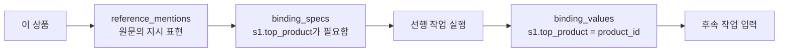

# Financial Product Agent 실행 계약

**Status:** Task 2 승인 설계

**Date:** 2026-08-17

**Decision:** [ADR-0005: Use Bounded LLM Roles and Typed Capability Execution](../decisions/ADR-0005-bounded-llm-typed-capability-execution.md)

**Related:** [Multi-Agent Architecture](MULTI_AGENT_ARCHITECTURE.md), [NCP Deployment Architecture](NCP_DEPLOYMENT_ARCHITECTURE.md), [Core Evaluation Set](../specs/core-evaluation-set.md)

## 1. 목적

이 문서는 평가 API가 질문을 받은 뒤 질문 해석, 실행, 검증, 답변 출력 단계가 서로 어떤 데이터를 주고받는지 정의한다. 실행 계약은 에이전트 수를 늘리는 장치가 아니다. LLM과 결정론적 컴포넌트 사이에 자유 문장 대신 검증 가능한 구조화 데이터만 전달하는 안전 경계다.

기본 경로에서 LLM은 다음 두 번만 호출한다.

1. **Intent Resolver:** 질문을 구조화된 `QueryPlan`으로 해석
2. **Answer Composer:** 검증된 `EvidenceBundle`로 답변 초안을 작성

조회, 관계 탐색, 필터, 정렬, 순위, 집계, 수익률 계산, 유사도, 비교 가능성, 근거 검증은 Capability Executor와 규칙 엔진이 수행한다.

## 2. 범위와 비범위

### 범위

- 대회용 단일 요청·단일 응답 모드
- 하나의 `question`에 포함된 여러 문장과 지시어
- 2026-07-11 데이터 컷오프와 버전 고정
- 구조화 계약, 멱등성, 근거 결합, 간결한 실행 기록
- PostgreSQL, Graph, Keyword, Vector, 계산기를 이용한 조건부 병렬 실행

### 비범위

- 실제 Pydantic 클래스와 JSON Schema 코드
- PostgreSQL 물리 테이블 DDL
- HyperCLOVA X 프롬프트 문구
- 세부 재시도·제한·답변 불가 전이표
- 원시 모델 사고과정 저장

## 3. 전체 흐름

```mermaid
flowchart LR
    API["평가 API 요청"] --> NORM["결정론적 입력 정규화기"]
    NORM --> RC["RequestContext"]
    RC --> IR["Intent Resolver"]
    IR --> QP["QueryPlan"]
    RC --> ORCH["결정론적 Orchestrator"]
    QP --> ORCH
    ORCH --> EG["ExecutionGraph"]
    EG --> EXE["Capability Executors"]
    EXE --> TR["ToolResult"]
    TR --> EB["EvidenceBundle"]
    EB --> VR["VerificationReport"]
    VR -->|PASS 또는 PARTIAL| AC["Answer Composer"]
    AC --> AD["AnswerDraft"]
    AD --> CG["Claim Gate"]
    CG --> RA["ReleasedAnswer"]
    VR -->|LIMITATION 또는 ABSTAIN| RA
```



7개 핵심 계약 그룹은 다음과 같다. `AnswerDraft`와 `ReleasedAnswer`는 하나의 응답 계약 그룹으로 본다.

| 번호 | 계약 그룹 | 생성자 | 주요 소비자 |
| ---: | --- | --- | --- |
| 1 | `RequestContext` | API 입력 정규화기 | Intent Resolver |
| 2 | `QueryPlan` | Intent Resolver | Orchestrator |
| 3 | `ExecutionGraph` | Orchestrator | Capability Executors |
| 4 | `ToolResult` | Capability Executors | 결과 통합기·근거 원장 |
| 5 | `EvidenceBundle` | 결과 통합기·근거 원장 | Verifier |
| 6 | `VerificationReport` | Verifier | Orchestrator·Answer Composer |
| 7 | `AnswerDraft` / `ReleasedAnswer` | Answer Composer / Claim Gate | 평가 API |

## 4. 모든 계약의 공통 규칙

### 4.1 공통 메타데이터

모든 최상위 계약은 다음 식별자를 공유한다.

| 필드 | 의미 |
| --- | --- |
| `schema_version` | 계약 스키마 버전 |
| `request_key` | `question_id + 정규화된 질문 + dataset_version + schema_version`의 결정론적 해시 |
| `run_id` | 재시도를 구분하는 실행 식별자 |
| `dataset_version` | PostgreSQL·Graph·Vector에 동시 활성화된 데이터 버전 |
| `cutoff_date` | 항상 `2026-07-11` |
| `producer` | 계약을 만든 컴포넌트 |
| `created_at` | 계약 생성 시각 |

`request_key`는 같은 질문과 데이터 버전의 멱등성을 판단한다. `run_id`는 주최측 재시도나 내부 재시도의 지연과 오류를 따로 분석할 때 사용한다.

### 4.2 검증과 버전

- 모든 계약은 알 수 없는 필드를 거부한다.
- 필수 필드 누락, 허용되지 않은 Enum, 데이터 버전 불일치는 실패다.
- 계약은 생성 후 수정하지 않고 다음 단계에서 새 객체를 만든다.
- 마이너 버전은 필드를 추가할 수 있지만 소비자가 지원하는 버전이어야 한다.
- 필드 제거나 의미 변경은 메이저 버전을 올린다.

### 4.3 안전 불변식

- LLM 자유 문장을 실행할 SQL, SPARQL, 수식, 필터로 사용하지 않는다.
- 모든 실행 작업은 허용된 작업·필드·계산식 등록부를 통과해야 한다.
- 하위 계약의 `dataset_version`은 `RequestContext`와 같아야 한다.
- 실행 결과는 상품명만이 아니라 안정된 상품·기업·증권·문서 ID를 포함해야 한다.
- Answer Composer는 `EvidenceBundle`과 통과한 `VerificationReport`에 없는 사실을 추가할 수 없다.
- 원시 모델 사고과정은 계약, 로그, `think_trace`에 저장하지 않는다.

## 5. 계약 참고 규격

### 5.1 `RequestContext`

`RequestContext`는 하나의 API 요청 안에 있는 모든 문장의 문맥을 소유한다. 검색용 문서 청크는 이 문맥의 소유자가 아니다.

| 필드 | 형태 | 의미 |
| --- | --- | --- |
| `question_id` | string | 주최측 질의 ID |
| `question` | string | 질문 원문 |
| `mode` | enum | 기본값 `competition` |
| `segments` | list | 순서가 있는 문장·의미 단위 |
| `named_entities` | list | 원문에 명시된 상품·기업·운용사·지수 후보 |
| `reference_mentions` | list | `이 상품`, `그 운용사`, `위 상품들` 같이 표면에 드러난 지시 표현 |
| `deadline_at` | datetime | 내부 안전 종료 시각 |

`named_entities`는 원문 표면에서 발견한 후보다. 정규식으로 확인할 수 있는 ISIN·티커·상품번호는 입력 정규화 단계에서 표시할 수 있지만, 실제 데이터셋의 안정된 ID로 확정하는 작업은 `ExecutionGraph`의 Entity Resolution 작업이 수행한다. 확정 상태는 `unresolved`, `resolved`, `ambiguous`, `not_found`, `invalid_at_cutoff`로 구분한다.

`연간수익률은?`, `위험등급도 보여줘`처럼 뒷문장의 주어가 생략되면 원문에 지시 단어가 없을 수 있다. 이때 Intent Resolver는 `QueryPlan.resolved_references`에 `mention_type=ellipsis`인 묵시적 지시를 생성하고, 해당 문장을 앞 문장의 명시 엔티티 또는 `binding_specs`에 연결한다. 따라서 표면 표현은 `RequestContext`, 생략 해소는 `QueryPlan`의 책임이다.

### 5.2 `QueryPlan`

Intent Resolver가 Structured Output으로 만드는 유일한 실행 전 LLM 계약이다.

| 필드 | 의미 |
| --- | --- |
| `intent_types` | `lookup`, `screen`, `rank`, `compare`, `aggregate`, `calculate`, `similar`, `explain` 중 하나 이상 |
| `product_families` | 국내채권, 국내 ETF, 해외 ETF, 공모펀드 |
| `subtasks` | 작업 단위로 분해한 질문 의도 |
| `entity_resolution_requests` | 명시 엔티티의 기대 타입과 식별 작업 |
| `resolved_references` | 지시어와 명시 엔티티 또는 중간 결과 자리의 연결 |
| `binding_specs` | 선행 작업이 생성해야 할 이름 있는 출력과 타입 |
| `dependency_edges` | 하위 작업 사이의 선행 관계 |
| `filters` | 정규화된 조건과 연산자 |
| `metrics` | 지표 의미, 기간, 단위, 통화, 수익률 유형 |
| `operations` | 요청된 조회·정렬·순위·집계·계산 |
| `result_shape` | 단일 값, 상품 목록, Top-K, 비교표, 설명 |
| `ambiguity_decisions` | 모호성과 적용한 기본값·분리·제한 규칙 |
| `requested_capabilities` | 필요한 RDB·Graph·Keyword·Vector·계산·비교 기능 |
| `initial_answerability` | `supported`, `requires_normalization`, `requires_additional_data`, `unsupported` |

`QueryPlan`은 선택할 수 있는 필드명, 연산자, 지표, 작업을 등록부의 ID로 표현한다. SQL, SPARQL, Python 수식, 테이블명은 포함하지 않는다.

### 5.3 `ExecutionGraph`

Orchestrator가 검증된 `QueryPlan`을 허용된 실행 작업 DAG로 컴파일한 결과다. DAG는 선행 작업의 결과가 필요한 작업만 순차로 실행하고, 나머지는 병렬로 실행하기 위한 작업 그래프다.

```text
ExecutionGraph
├─ graph_id
├─ tasks
│  ├─ task_id
│  ├─ capability
│  ├─ operation_id
│  ├─ literal_inputs
│  ├─ binding_inputs
│  ├─ depends_on
│  ├─ expected_output_type
│  ├─ required_evidence_fields
│  └─ budget_ms
├─ binding_specs
├─ critical_path
└─ total_budget_ms
```

기본 Capability는 `rdb_lookup`, `graph_traversal`, `keyword_search`, `vector_search`, `financial_calculation`, `ranking`, `similarity`, `comparison`이다. Capability는 역할을 나타낼 뿐 해당 역할을 LLM이 수행한다는 뜻이 아니다.

### 5.4 `ToolResult`

각 Capability Executor는 작업 하나당 하나의 `ToolResult`를 반환한다.

| 필드 | 의미 |
| --- | --- |
| `task_id` | `ExecutionGraph`의 작업 ID |
| `status` | `success`, `empty`, `unsupported`, `invalid_input`, `timeout`, `transient_error`, `permanent_error` |
| `result_type` | 행, 스칼라, 엔티티 참조, 관계 경로, 계산, 비교 결정 |
| `result_rows` | 안정된 ID와 필드 ID를 포함한 결과 |
| `binding_values` | 후속 작업이 사용할 중간 결과 |
| `evidence_refs` | 이 결과를 입증하는 근거 ID |
| `exclusions` | 제외 대상과 규칙 기반 사유 |
| `warnings` | 누락, 오래된 값, 부분 지원 등 |
| `result_hash` | 정렬 순서까지 고정한 결과 해시 |
| `latency_ms` | 작업 소요 시간 |

`empty`는 실행 오류가 아니다. 조건에 맞는 결과가 없다는 증거가 될 수 있으므로 조회 범위와 적용한 필터를 근거로 남긴다.

### 5.5 `EvidenceBundle`

결과 통합기와 근거 원장이 `ToolResult`를 하나의 검증 단위로 묶는다.

```text
EvidenceBundle
├─ answered_subtasks
├─ unanswered_subtasks
├─ facts
├─ calculations
├─ comparison_decisions
├─ evidence_refs
├─ exclusions
├─ missing_data
├─ applied_defaults
├─ limitations
└─ allowed_claims
```

`allowed_claims`는 자유로운 답변 문장이 아니라 근거 ID가 결합된 구조화 주장이다. 예를 들어 `product_rank`, `metric_value`, `holds_security`, `similarity_reason`, `data_limitation`과 같은 주장 유형을 사용한다.

### 5.6 `VerificationReport`

Verifier는 `EvidenceBundle`을 수정하지 않고 독립된 판정을 반환한다.

| 필드 | 의미 |
| --- | --- |
| `disposition` | `pass`, `partial`, `limitation`, `abstain`, `repairable_failure`, `internal_failure` |
| `coverage` | 질문의 하위 작업별 답변 가능 여부 |
| `source_checks` | 사실·수치와 출처 연결 결과 |
| `calculation_checks` | 입력값·수식·결과 재현 결과 |
| `compatibility_checks` | 기간·정의·단위·통화·모집단 검사 |
| `cutoff_checks` | 관측·적용·공개일 컷오프 검사 |
| `policy_checks` | 예측·단정적 추천·누락값 추정 검사 |
| `repair_actions` | 허용된 한 번의 내부 수정 지시 |
| `releaseable_claim_ids` | 답변에 사용해도 되는 주장 ID |

`pass`와 `partial`만 Answer Composer를 호출할 수 있다. `limitation`과 `abstain`은 Orchestrator가 템플릿 기반으로 안전한 답변을 구성할 수 있다. 정확한 판정 조건과 재시도 전이는 다음 설계 단계에서 확정한다.

### 5.7 `AnswerDraft` 및 `ReleasedAnswer`

`AnswerDraft`는 사용자에게 보일 결과, 조건, 비교표, 설명, 한계, 출처 요약으로 구성된다. 모든 사실 문장과 표의 셀은 `claim_id`와 `evidence_ids`를 가져야 한다.

Claim Gate를 통과한 `ReleasedAnswer`는 다음을 포함한다.

| 필드 | 의미 |
| --- | --- |
| `disposition` | 최종 답변 상태 |
| `answer_text` | 검증된 최종 답변 |
| `retrieved_context_text` | 실제 사용한 근거만 요약한 문자열 |
| `think_trace_text` | 의도·하위 작업·필터·계산·출처·제외·한계의 간결한 실행 기록 |
| `claim_bindings` | 최종 문장과 근거 ID 연결 |
| `response_hash` | 최종 응답 문자열의 해시 |

평가 API Adapter는 `ReleasedAnswer`를 주최측이 요구한 `question_id`, `question`, `retrieved_context`, `think_trace`, `answer` 다섯 문자열로 변환한다.

## 6. 지시어와 중간 결과 바인딩

`RequestContext.reference_mentions`, `QueryPlan.binding_specs`, `ToolResult.binding_values`는 서로 다른 개념이다.



- `reference_mentions`는 원문의 표현이다.
- `binding_specs`는 아직 알 수 없는 중간 결과의 이름과 형태다.
- `binding_values`는 결정론적 실행 후 얻은 실제 ID 또는 ID 목록이다.
- LLM은 `binding_values`를 만들 수 없다.
- 대상이 복수면 단수로 임의 축소하지 않고 복수 ID를 유지하거나 제한으로 전환한다.

## 7. 예시 질문의 계약 흐름

질문:

> 삼성전자가 들어간 ETF를 AUM순으로 5개 알려줘. 이 상품들 중 1년 수익률이 가장 높은 상품과 비슷한 상품도 알려줘.

### `RequestContext`

```text
segments: [s1, s2]
named_entities: [삼성전자, ETF, AUM, 1년 수익률]
reference_mentions: [s2."이 상품들"]
```

### `QueryPlan`

```text
q1: 삼성전자 증권 ID 식별
q2: 해당 증권을 편입한 ETF 탐색
q3: AUM 내림차순 Top 5
q4: s1.top5_products 안에서 1년 누적수익률 1위
q5: s2.top_return_product와 유사한 상품 탐색
binding_specs: [s1.top5_products: product_ref_list, s2.top_return_product: product_ref]
dependency_edges: [q1 -> q2 -> q3 -> q4 -> q5]
```

### `ExecutionGraph`

```text
t1 keyword/rdb entity resolution
t2 graph_traversal depends_on t1
t3 rdb_lookup + ranking depends_on t2
t4 ranking depends_on t3
t5 similarity depends_on t4
```

상품 편입 관계와 AUM은 서로 다른 저장소에서 가져올 수 있지만 `dataset_version`과 각 값의 기준일은 반드시 일치·호환 검사를 통과해야 한다.

## 8. 저장과 감사 범위

실행 계약은 [NCP Deployment Architecture](NCP_DEPLOYMENT_ARCHITECTURE.md)의 PostgreSQL `operations`와 `evidence` 스키마에 저장한다.

| 대상 | 저장 범위 |
| --- | --- |
| `RequestContext` | 정규화된 질문, 문장, 식별자, 데이터 버전 |
| `QueryPlan` | 전체 구조화 JSON과 프롬프트·모델 버전 |
| `ExecutionGraph` | 작업 DAG, 할당 시간, 해시 |
| `ToolResult` | 상태, 선택된 결과, 근거, 제외, 결과 해시, 지연 |
| `EvidenceBundle` | 최종 답변 판단에 사용된 사실·계산·근거 |
| `VerificationReport` | 검사별 통과 여부와 최종 판정 |
| `ReleasedAnswer` | 공식 5필드 응답, claim 바인딩, 응답 해시 |

대용량 중간 행 전체를 무조건 영구 저장하지 않는다. 최종 선택 행, 제외 요약, 소스 참조, `result_hash`를 저장하고 전체 재현에 필요한 실행 계획을 유지한다.

다음은 저장하지 않는다.

- 원시 Chain-of-Thought
- 비밀키·인증 헤더
- 새로운 사실을 담은 검증 전 자유 문장
- 필요 이상의 원본 문서 전체 복사본

## 9. 시간 예산 전달 원칙

- `RequestContext.deadline_at`은 외부 300초 제한보다 짧은 내부 마감을 사용한다.
- Orchestrator는 `ExecutionGraph.total_budget_ms`를 선행 작업과 병렬 작업에 배분한다.
- 하위 작업은 상위 마감을 넘는 시간 예산을 받을 수 없다.
- 마감이 임박하면 선택적 Vector 확장 검색과 부가 설명을 중단할 수 있지만 근거 검증을 생략할 수는 없다.
- 시간 예산과 재시도 횟수는 다음 실패 처리 설계에서 정확한 수치로 확정한다.

## 10. 수용 기준

- 모든 최상위 계약에 `schema_version`, `request_key`, `run_id`, `dataset_version`, `cutoff_date`가 존재한다.
- 알 수 없는 필드, 허용되지 않은 작업, 잘못된 바인딩 타입을 거부한다.
- 여러 문장의 지시어가 선행 작업의 중간 결과에 타입 안전하게 바인딩된다.
- 동일한 `request_key`와 `dataset_version`의 결정론적 결과가 같다.
- 모든 수치 결과는 소스 필드, 단위, 기준일, 상품 ID에 연결된다.
- 계산은 등록된 입력과 수식으로 재현된다.
- 검증을 통과하지 않은 주장이 `ReleasedAnswer`에 포함되지 않는다.
- 최종 응답이 공식 API의 다섯 문자열로 손실 없이 변환된다.
- 기본 정상 경로에서 LLM 호출이 Intent Resolver와 Answer Composer 두 번을 넘지 않는다.

## 11. 다음 설계 단계

다음에는 `VerificationReport.disposition`의 정확한 판정 규칙을 설계한다. 질문의 일부만 지원될 때 `partial`, 유용한 제한 정보만 제공할 때 `limitation`, 어떤 실질적 주장도 지지할 수 없을 때 `abstain`으로 분리하는 기준과 재시도·시간 예산 전이를 확정해야 한다.
