# Financial Product Agent 실행 계약

**Status:** Task 2 승인 설계; 2026-08-18 실행 계약·손실 없는 태그 값 보강안 승인; 2026-08-31 Stage 06 Intent Resolver 내부 경계 보정 승인·미구현

**Date:** 2026-08-17 (2026-08-18 실행 계약 보강, 2026-08-31 Intent Resolver 목표 경계 보정)

**Decisions:** [ADR-0005: Use Bounded LLM Roles and Typed Capability Execution](../decisions/ADR-0005-bounded-llm-typed-capability-execution.md), [ADR-0006: Separate Answer Disposition from Execution Failure and Bound Recovery](../decisions/ADR-0006-separate-disposition-and-bound-recovery.md), [ADR-0007: Use a Normalized Evidence Ledger and Structured Answer Plans](../decisions/ADR-0007-normalized-evidence-ledger-structured-answer-plan.md), [ADR-0008: Use Lossless Tagged Values](../decisions/ADR-0008-lossless-tagged-contract-values.md), [ADR-0022: Use Ontology-Grounded Intent Resolution](../decisions/ADR-0022-use-ontology-grounded-intent-resolution.md)

**Related:** [Multi-Agent Architecture](MULTI_AGENT_ARCHITECTURE.md), [Failure and Disposition Policy](FAILURE_AND_DISPOSITION_POLICY.md), [Evidence, Verification, and Rendering](EVIDENCE_VERIFICATION_AND_RENDERING.md), [NCP Deployment Architecture](NCP_DEPLOYMENT_ARCHITECTURE.md), [Core Evaluation Set](../specs/core-evaluation-set.md)

> **Current-baseline notice:** The JSON shape remains approved, but every fixed `2026-07-11` cutoff literal below is superseded by `2026-08-24` under [ADR-0016](../decisions/ADR-0016-use-2026-08-24-organizer-baseline.md). The minimal compatibility migration is proposed in [ADR-0017](../decisions/ADR-0017-adopt-current-cutoff-with-legacy-preservation.md).

> **Stage 06 target-boundary notice:** [ADR-0022](../decisions/ADR-0022-use-ontology-grounded-intent-resolution.md) keeps the external `RequestContext → Intent Resolver component → QueryPlan` handoff and the frozen `QueryPlan` JSON shape. Inside that component, the target flow is now `IntentResolutionDraft → deterministic validation → ValidatedIntentResolution → deterministic QueryPlan compiler`. The internal artifact and provenance migration described below are approved design targets, not implemented runtime state.

## 1. 목적

이 문서는 평가 API가 질문을 받은 뒤 질문 해석, 실행, 검증, 답변 출력 단계가 서로 어떤 데이터를 주고받는지 정의한다. 실행 계약은 에이전트 수를 늘리는 장치가 아니다. LLM과 결정론적 컴포넌트 사이에 자유 문장 대신 검증 가능한 구조화 데이터만 전달하는 안전 경계다.

기본 경로에서 LLM은 다음 두 번만 호출한다.

1. **Intent Resolver component:** 한 번의 구조화 모델 호출로 내부 초안을 만들고, 결정론적 검증·컴파일을 거쳐 구조화된 `QueryPlan`을 생성
2. **Answer Composer:** 검증된 Claim을 승인된 블록·템플릿에 배치한 `AnswerPlan`을 작성

조회, 관계 탐색, 필터, 정렬, 순위, 집계, 수익률 계산, 유사도, 비교 가능성, 근거 검증은 Capability Executor와 규칙 엔진이 수행한다.

## 2. 범위와 비범위

### 범위

- 대회용 단일 요청·단일 응답 모드
- 하나의 `question`에 포함된 여러 문장과 지시어
- 2026-07-11 데이터 컷오프와 버전 고정
- 구조화 계약, 멱등성, 근거 결합, 간결한 실행 기록
- PostgreSQL, Graph, Keyword, Vector, 계산기를 이용한 조건부 병렬 실행

### 비범위

- 실제 Pydantic 클래스와 JSON Schema 코드
- PostgreSQL 물리 테이블 DDL
- HyperCLOVA X 프롬프트 문구
- 세부 재시도·제한·답변 불가 전이표
- 원시 모델 사고과정 저장

## 3. 전체 흐름

```mermaid
flowchart LR
    API["평가 API 요청"] --> NORM["결정론적 입력 정규화기"]
    NORM --> RC["RequestContext"]
    RC --> IR["Intent Resolver"]
    IR --> QP["QueryPlan"]
    RC --> ORCH["결정론적 Orchestrator"]
    QP --> ORCH
    ORCH --> EG["ExecutionGraph"]
    EG --> EXE["Capability Executors"]
    EXE --> TR["ToolResult"]
    TR --> EB["EvidenceBundle"]
    EB --> VR["VerificationReport"]
    VR -->|PASS + ANSWER/PARTIAL| AC["Answer Composer"]
    VR -->|PASS + LIMITATION/ABSTAIN| SAFE["결정론적 Safe Plan Builder"]
    AC --> AP["AnswerPlan"]
    SAFE --> AP
    AP --> CG["Claim Gate"]
    CG --> RENDER["결정론적 Renderer"]
    RENDER --> RA["ReleasedAnswer"]
    VR -->|FAIL| ORCH
```



7개 핵심 계약 그룹은 다음과 같다. `AnswerPlan`과 `ReleasedAnswer`는 하나의 응답 계약 그룹으로 본다.

| 번호 | 계약 그룹 | 생성자 | 주요 소비자 |
| ---: | --- | --- | --- |
| 1 | `RequestContext` | API 입력 정규화기 | Intent Resolver |
| 2 | `QueryPlan` | Intent Resolver component의 결정론적 compiler | Orchestrator |
| 3 | `ExecutionGraph` | Orchestrator | Capability Executors |
| 4 | `ToolResult` | Capability Executors | 결과 통합기·근거 원장 |
| 5 | `EvidenceBundle` | 결과 통합기·근거 원장 | Verifier |
| 6 | `VerificationReport` | Verifier | Orchestrator·Answer Composer |
| 7 | `AnswerPlan` / `ReleasedAnswer` | Answer Composer / Claim Gate·Renderer | 평가 API |

## 4. 모든 계약의 공통 규칙

### 4.1 공통 메타데이터

모든 최상위 계약은 다음 식별자를 공유한다.

| 필드 | 의미 |
| --- | --- |
| `schema_version` | 계약 스키마 버전 |
| `request_key` | `question_id + 정규화된 질문 + dataset_version + schema_version`의 결정론적 해시 |
| `run_id` | 재시도를 구분하는 실행 식별자 |
| `dataset_version` | PostgreSQL·Graph·Vector에 동시 활성화된 데이터 버전 |
| `cutoff_date` | 항상 `2026-07-11` |
| `producer` | 계약을 만든 컴포넌트 |
| `created_at` | 계약 생성 시각 |

`request_key`는 같은 질문과 데이터 버전의 멱등성을 판단한다. `run_id`는 주최측 재시도나 내부 재시도의 지연과 오류를 따로 분석할 때 사용한다.

### 4.2 검증과 버전

- 모든 계약은 알 수 없는 필드를 거부한다.
- 필수 필드 누락, 허용되지 않은 Enum, 데이터 버전 불일치는 실패다.
- 계약은 생성 후 수정하지 않고 다음 단계에서 새 객체를 만든다.
- 마이너 버전은 필드를 추가할 수 있지만 소비자가 지원하는 버전이어야 한다.
- 필드 제거나 의미 변경은 메이저 버전을 올린다.

Python 경계는 실제 타입이 부여된 값만 받고, JSON 경계는 원본 문자열·바이트를 `model_validate_json`으로 검증한다. 이미 JSON을 디코딩한 일반 Python 딕셔너리를 편의상 느슨한 Python 입력으로 재해석하지 않는다.

`ScalarValue`와 `ContractValue`는 `null`, `string`, `integer`, `decimal`, `boolean`, `date`, `datetime`, `tuple`의 명시적 `type` 태그를 사용한다. `tuple`의 각 원소는 별도의 스칼라 태그를 갖고 중첩 튜플은 금지한다. Decimal은 지수 표기·선행 0·무의미한 후행 0·음수 0이 없는 정규 문자열로 JSON에 표현한다. 이 태그 형식과 인코딩·디코딩 규칙은 Stage 01이 소유하며, Stage 02는 같은 형태를 JSONB에 저장하고 별도의 Python 코덱을 만들지 않는다.

### 4.3 안전 불변식

- LLM 자유 문장을 실행할 SQL, SPARQL, 수식, 필터로 사용하지 않는다.
- 모든 실행 작업은 허용된 작업·필드·계산식 등록부를 통과해야 한다.
- 하위 계약의 `dataset_version`은 `RequestContext`와 같아야 한다.
- 실행 결과는 상품명만이 아니라 안정된 상품·기업·증권·문서 ID를 포함해야 한다.
- Answer Composer는 `releaseable_claim_ids`에 없는 Claim을 선택할 수 없고, 상품명·수치·날짜·단위·출처 문자열을 생성할 수 없다.
- 원시 모델 사고과정은 계약, 로그, `think_trace`에 저장하지 않는다.

## 5. 계약 참고 규격

### 5.1 `RequestContext`

`RequestContext`는 하나의 API 요청 안에 있는 모든 문장의 문맥을 소유한다. 검색용 문서 청크는 이 문맥의 소유자가 아니다.

| 필드 | 형태 | 의미 |
| --- | --- | --- |
| `question_id` | string | 주최측 질의 ID |
| `question` | string | 질문 원문 |
| `mode` | enum | 기본값 `competition` |
| `segments` | list | 순서가 있는 문장·의미 단위 |
| `named_entities` | list | 원문에 명시된 상품·기업·운용사·지수 후보 |
| `reference_mentions` | list | `이 상품`, `그 운용사`, `위 상품들` 같이 표면에 드러난 지시 표현 |
| `deadline_at` | datetime | 내부 안전 종료 시각 |

`named_entities`는 원문 표면에서 발견한 후보다. 정규식으로 확인할 수 있는 ISIN·티커·상품번호는 입력 정규화 단계에서 표시할 수 있지만, 실제 데이터셋의 안정된 ID로 확정하는 작업은 `ExecutionGraph`의 Entity Resolution 작업이 수행한다. 확정 상태는 `unresolved`, `resolved`, `ambiguous`, `not_found`, `invalid_at_cutoff`로 구분한다.

`연간수익률은?`, `위험등급도 보여줘`처럼 뒷문장의 주어가 생략되면 원문에 지시 단어가 없을 수 있다. 이때 Intent Resolver component는 내부의 검증된 문맥 링크를 `QueryPlan.resolved_references`의 `mention_type=ellipsis` 참조로 결정론적으로 컴파일하고, 해당 문장을 앞 문장의 명시 엔티티 또는 `binding_specs`에 연결한다. 따라서 표면 표현은 `RequestContext`, 문맥 해소 판단은 `ValidatedIntentResolution`, 실행 계약으로의 투영은 `QueryPlan`의 책임이다.

### 5.2 `QueryPlan`

`QueryPlan`은 Intent Resolver component가 Orchestrator에 전달하는 유일한 실행 전 외부 계약이다. ADR-0022 이후 모델이 이 계약을 직접 작성하지 않으며, 검증된 온톨로지·catalog ID와 typed context link를 결정론적 compiler가 기존 JSON shape으로 투영한다.

| 필드 | 의미 |
| --- | --- |
| `intent_types` | `lookup`, `screen`, `rank`, `compare`, `aggregate`, `calculate`, `similar`, `explain` 중 하나 이상 |
| `product_families` | 국내채권, 국내 ETF, 해외 ETF, 공모펀드 |
| `subtasks` | 작업 단위로 분해한 질문 의도 |
| `entity_resolution_requests` | 명시 엔티티의 기대 타입과 식별 작업 |
| `resolved_references` | 지시어와 명시 엔티티 또는 중간 결과 자리의 연결 |
| `binding_specs` | 선행 작업이 생성해야 할 이름 있는 출력과 타입 |
| `dependency_edges` | 하위 작업 사이의 선행 관계 |
| `filters` | 정규화된 조건과 연산자 |
| `metrics` | 지표 의미, 기간, 단위, 통화, 수익률 유형 |
| `operations` | 요청된 조회·정렬·순위·집계·계산 |
| `result_shape` | 단일 값, 상품 목록, Top-K, 비교표, 설명 |
| `ambiguity_decisions` | 모호성과 적용한 기본값·분리·제한 규칙 |
| `requested_capabilities` | 필요한 RDB·Graph·Keyword·Vector·계산·비교 기능 |
| `initial_answerability` | `supported`, `requires_normalization`, `requires_additional_data`, `unsupported` |

`QueryPlan`은 선택할 수 있는 필드명, 연산자, 지표, 작업을 등록부의 ID로 표현한다. SQL, SPARQL, Python 수식, 테이블명은 포함하지 않는다.

### 5.3 `ExecutionGraph`

Orchestrator가 검증된 `QueryPlan`을 허용된 실행 작업 DAG로 컴파일한 결과다. DAG는 선행 작업의 결과가 필요한 작업만 순차로 실행하고, 나머지는 병렬로 실행하기 위한 작업 그래프다.

```text
ExecutionGraph
├─ graph_id
├─ tasks
│  ├─ task_id
│  ├─ subtask_id
│  ├─ capability
│  ├─ operation_id
│  ├─ literal_inputs
│  ├─ binding_inputs
│  ├─ produces_bindings
│  ├─ depends_on
│  ├─ expected_output_type
│  ├─ required_evidence_fields
│  └─ budget_ms
├─ binding_specs
├─ critical_path
└─ total_budget_ms
```

기본 Capability는 `rdb_lookup`, `graph_traversal`, `keyword_search`, `vector_search`, `financial_calculation`, `ranking`, `similarity`, `comparison`이다. Capability는 역할을 나타낼 뿐 해당 역할을 LLM이 수행한다는 뜻이 아니다.

`subtask_id`는 해당 실행 작업이 `QueryPlan`의 어느 하위 질문을 구현하는지 나타낸다. `operation_id`는 해당 하위 질문에 속한 `QueryPlan.operations.operation_id`를 참조한다. 하나의 논리 작업이 여러 Capability 작업으로 컴파일될 수 있으므로 여러 `ExecutionTask`가 같은 `operation_id`를 가질 수 있다.

`produces_bindings`는 해당 작업이 성공했을 때 생성할 수 있는 중간 결과 이름이다. 모든 입력·출력 바인딩은 `ExecutionGraph.binding_specs`에 선언되어야 하며, 하나의 바인딩은 하나의 작업만 생성한다. 생성 작업의 `subtask_id`는 `BindingSpec.producer_subtask_id`와 같아야 하고, 소비 작업은 생성 작업에 직접 또는 전이적으로 의존해야 한다. 같은 작업이 같은 바인딩을 동시에 입력과 출력으로 선언할 수 없다.

`critical_path`는 중복 없는 작업 ID의 연속 경로이다. 인접한 작업은 DAG에서 직접 의존 관계여야 하며, 경로의 `budget_ms` 합은 `total_budget_ms`를 넘을 수 없다. 병렬 분기의 예산은 합산하지 않고, 명시된 임계 경로만 검사한다.

### 5.4 `ToolResult`

각 Capability Executor는 작업 하나당 하나의 `ToolResult`를 반환한다.

| 필드 | 의미 |
| --- | --- |
| `task_id` | `ExecutionGraph`의 작업 ID |
| `status` | `success`, `empty`, `unsupported`, `invalid_input`, `timeout`, `transient_error`, `permanent_error` |
| `result_type` | 행, 스칼라, 엔티티 참조, 관계 경로, 계산, 비교 결정 |
| `result_rows` | 안정된 ID와 필드 ID를 포함한 결과 |
| `binding_values` | 후속 작업이 사용할 중간 결과 |
| `evidence_refs` | 이 결과를 입증하는 근거 ID |
| `exclusions` | 제외 대상과 규칙 기반 사유 |
| `warnings` | 누락, 오래된 값, 부분 지원 등 |
| `result_hash` | 정렬 순서까지 고정한 결과 해시 |
| `latency_ms` | 작업 소요 시간 |

`empty`는 실행 오류가 아니다. 조건에 맞는 결과가 없다는 증거가 될 수 있으므로 조회 범위와 적용한 필터를 근거로 남긴다.

`success` 상태에서만 검증 가능한 결과 행 또는 바인딩 값을 실을 수 있다. `empty`와 오류 상태는 `result_rows`나 `binding_values`를 실어 성공 데이터와 실패 상태를 섞을 수 없다. 다만 검색 범위, 제외, 경고 등 실패와 독립적인 감사 정보는 보존할 수 있다.

#### 5.4.1 계약 간 교차 검증

개별 Pydantic 모델의 구조 검증만으로는 서로 다른 산출물 사이의 일치를 보장할 수 없다. Orchestrator는 다음 두 교차 검증을 결정론적으로 실행한다.

1. `QueryPlan → ExecutionGraph`
   - `request_key`, `run_id`, `dataset_version`, `cutoff_date`가 같은지 검사한다.
   - Graph의 바인딩 정의가 Plan의 이름·타입·생산 하위 작업·카디널리티와 같은지 검사한다.
   - 모든 `ExecutionTask.subtask_id`와 `operation_id`가 Plan에 존재하고 서로 같은 하위 작업에 속하는지 검사한다.
   - Graph가 사용하는 Capability가 Plan의 `requested_capabilities`에 포함되는지 검사한다.
2. `ExecutionGraph → ToolResult`
   - 실행 메타데이터와 `task_id`가 같은 질문·데이터셋·작업을 가리키는지 검사한다.
   - `result_type`이 작업의 `expected_output_type`과 같은지 검사한다.
   - `binding_values`가 해당 작업의 `produces_bindings`에만 속하고, 선언된 `value_type`과 `cardinality`를 따르는지 검사한다. `one`은 단일 스칼라, `many`는 튜플을 사용한다.

교차 검증 실패는 LLM이 보정할 자연어 문제가 아니라 계약 또는 컴파일러 결함이다. 검증되지 않은 Graph 또는 ToolResult를 다음 계층으로 전달하지 않는다.

### 5.5 `EvidenceBundle`

결과 통합기와 근거 원장이 `ToolResult`를 하나의 검증 단위로 묶는다.

```text
EvidenceBundle
├─ bundle_id
├─ answered_subtasks
├─ unanswered_subtasks
├─ evidence_ids
├─ calculation_ids
├─ candidate_claim_ids
├─ exclusion_evidence_ids
├─ missing_data
├─ applied_defaults
├─ limitations
└─ bundle_hash
```

`candidate_claim_ids`는 Capability별 결정론적 생성 규칙이 만든 원자적 Claim을 가리킨다. Verifier 통과 전이므로 `allowed`라고 부르지 않는다. 세부 원장과 필수 근거는 [Evidence, Verification, and Rendering](EVIDENCE_VERIFICATION_AND_RENDERING.md)을 따른다.

### 5.6 `VerificationReport`

Verifier는 `EvidenceBundle`을 수정하지 않고 독립된 판정을 반환한다.

| 필드 | 의미 |
| --- | --- |
| `verification_report_id` | 불변 검증 보고서 ID |
| `verification_status` | `pass`, `fail` |
| `recommended_answer_disposition` | `answer`, `partial`, `limitation`, `abstain` 또는 실행 실패 시 `null` |
| `claim_checks` | Claim별 계약·출처·시간·온톨로지·정책 검사 결과 |
| `calculation_checks` | 입력값·수식·결과 재현 결과 |
| `subtask_coverage` | 질문의 하위 작업별 답변 가능 여부 |
| `releaseable_claim_ids` | 답변에 사용해도 되는 주장 ID |
| `rejected_claims` | 거부 Claim과 안정된 사유 코드 |
| `warnings` | 중심 결론을 바꾸지 않는 경고 |
| `disposition_reasons` | 최종 답변 판정의 근거 |
| `repair_actions` | 요청 전체 회복 예산 안에서 허용된 수정 지시 |

`verification_status=pass`는 판정과 근거가 출시 가능하다는 뜻이므로 `limitation`과 `abstain`도 `pass`일 수 있다. `pass`인 `answer`와 `partial`만 Answer Composer를 호출하고, `limitation`과 `abstain`은 Orchestrator가 검증된 판정 사유를 템플릿으로 구성한다. 두 경로 모두 Claim Gate를 통과해야 한다. 시스템 실패는 `AnswerDisposition`으로 표현하지 않는다. 세부 판정과 재시도 규칙은 [Failure and Disposition Policy](FAILURE_AND_DISPOSITION_POLICY.md)를 따른다.

### 5.7 `AnswerPlan` 및 `ReleasedAnswer`

`AnswerPlan`은 자유 문장 초안이 아니라 검증된 Claim을 등록된 문단·표·비교·제한 템플릿에 배치하는 구조화 계획이다. Claim Gate는 Claim·블록·열·커버리지를 검사하고, Renderer가 숫자·날짜·단위·출처를 실제 문자열로 만든다.

Stage 01의 `AnswerPlan` 계약은 `renderer_profile_id`, `template_id`, `columns`, block·slot ID와 Claim ID를 일반 `Identifier`로 유지하며 사실값을 담는 필드가 없다는 구조만 보장한다. 이 단계의 타입 검증은 등록부 승인이나 호환성을 증명하지 않는다. 출시 전의 Claim Gate는 등록되지 않은 renderer profile, template, column, block·slot 사용을 모두 거부하고, Claim과 template·column·slot의 바인딩 호환성까지 반드시 검증해야 한다. 이 검사를 통과한 계획만 Renderer와 `ReleasedAnswer`로 전달할 수 있다.

Claim Gate를 통과한 `ReleasedAnswer`는 다음을 포함한다.

| 필드 | 의미 |
| --- | --- |
| `answer_disposition` | `answer`, `partial`, `limitation`, `abstain` 중 최종 답변 상태 |
| `answer_text` | 검증된 최종 답변 |
| `retrieved_context_text` | 실제 사용한 근거만 요약한 문자열 |
| `think_trace_text` | 의도·하위 작업·필터·계산·출처·제외·한계의 간결한 실행 기록 |
| `claim_bindings` | 최종 문장·표 셀과 Claim·근거 ID 연결 |
| `response_hash` | 최종 응답 문자열의 해시 |

평가 API Adapter는 `ReleasedAnswer`를 주최측이 요구한 `question_id`, `question`, `retrieved_context`, `think_trace`, `answer` 다섯 문자열로 변환한다.

## 6. 지시어와 중간 결과 바인딩

`RequestContext.reference_mentions`, `QueryPlan.binding_specs`, `ToolResult.binding_values`는 서로 다른 개념이다.


- `reference_mentions`는 원문의 표현이다.
- `binding_specs`는 아직 알 수 없는 중간 결과의 이름과 형태다.
- `binding_values`는 결정론적 실행 후 얻은 실제 ID 또는 ID 목록이다.
- LLM은 `binding_values`를 만들 수 없다.
- 대상이 복수면 단수로 임의 축소하지 않고 복수 ID를 유지하거나 제한으로 전환한다.

## 7. 예시 질문의 계약 흐름

질문:

> 삼성전자가 들어간 ETF를 AUM순으로 5개 알려줘. 이 상품들 중 1년 수익률이 가장 높은 상품과 비슷한 상품도 알려줘.

### `RequestContext`

```text
segments: [s1, s2]
named_entities: [삼성전자, ETF, AUM, 1년 수익률]
reference_mentions: [s2."이 상품들"]
```

### `QueryPlan`

```text
q1: 삼성전자 증권 ID 식별
q2: 해당 증권을 편입한 ETF 탐색
q3: AUM 내림차순 Top 5
q4: s1.top5_products 안에서 1년 누적수익률 1위
q5: s2.top_return_product와 유사한 상품 탐색
binding_specs: [s1.top5_products: product_ref_list, s2.top_return_product: product_ref]
dependency_edges: [q1 -> q2 -> q3 -> q4 -> q5]
```

### `ExecutionGraph`

```text
t1 keyword/rdb entity resolution
t2 graph_traversal depends_on t1
t3 rdb_lookup + ranking depends_on t2
t4 ranking depends_on t3
t5 similarity depends_on t4
```

상품 편입 관계와 AUM은 서로 다른 저장소에서 가져올 수 있지만 `dataset_version`과 각 값의 기준일은 반드시 일치·호환 검사를 통과해야 한다.

## 8. 저장과 감사 범위

실행 계약은 [NCP Deployment Architecture](NCP_DEPLOYMENT_ARCHITECTURE.md)의 PostgreSQL `operations`와 `evidence` 스키마에 저장한다.

| 대상 | 저장 범위 |
| --- | --- |
| `RequestContext` | 정규화된 질문, 문장, 식별자, 데이터 버전 |
| `intent_resolution` | Stage 06에서 추가할 내부 검증 artifact, catalog·ontology·model·prompt provenance; 아직 미구현 |
| `QueryPlan` | 전체 구조화 JSON과 compiler·catalog 버전; 현재 구현 스키마의 프롬프트·모델 provenance는 Stage 06 migration 전까지 유지 |
| `ExecutionGraph` | 작업 DAG, 할당 시간, 해시 |
| `ToolResult` | 상태, 선택된 결과, 근거, 제외, 결과 해시, 지연 |
| `EvidenceBundle` | 최종 답변 판단에 사용된 사실·계산·근거 |
| `VerificationReport` | 검사별 통과 여부와 최종 판정 |
| `AnswerPlan` | 검증된 Claim의 블록·템플릿·표 셀 배치 |
| `ReleasedAnswer` | 공식 5필드 응답, claim 바인딩, 응답 해시 |

대용량 중간 행 전체를 무조건 영구 저장하지 않는다. 최종 선택 행, 제외 요약, 소스 참조, `result_hash`를 저장하고 전체 재현에 필요한 실행 계획을 유지한다.

다음은 저장하지 않는다.

- 원시 Chain-of-Thought
- 비밀키·인증 헤더
- 새로운 사실을 담은 검증 전 자유 문장
- 필요 이상의 원본 문서 전체 복사본

## 9. 시간 예산 전달 원칙

- `RequestContext.deadline_at`은 초기에 요청 시작 후 55초로 설정한다.
- Orchestrator는 `ExecutionGraph.total_budget_ms`를 선행 작업과 병렬 작업에 배분한다.
- 하위 작업은 상위 마감을 넘는 시간 예산을 받을 수 없다.
- 마감이 임박하면 선택적 Vector 확장 검색과 부가 설명을 중단할 수 있지만 근거 검증을 생략할 수는 없다.
- 50초 이후에는 새 LLM 호출이나 조회를 시작하지 않고, 마지막 5초를 검증된 JSON의 직렬화·전송에 보존한다.
- 재시도와 실측 후 시간 조정은 [Failure and Disposition Policy](FAILURE_AND_DISPOSITION_POLICY.md)를 따른다.

## 10. 수용 기준

- 모든 최상위 계약에 `schema_version`, `request_key`, `run_id`, `dataset_version`, `cutoff_date`가 존재한다.
- 알 수 없는 필드, 허용되지 않은 작업, 잘못된 바인딩 타입을 거부한다.
- 여러 문장의 지시어가 선행 작업의 중간 결과에 타입 안전하게 바인딩된다.
- 모든 실행 작업의 하위 질문·작업·Capability 출처가 `QueryPlan`까지 역추적된다.
- 바인딩의 유일한 생산자, 의존 경로, 값 타입, 단수·복수가 `ExecutionGraph`과 `ToolResult` 사이에서 일치한다.
- 임계 경로의 작업 예산 합이 `total_budget_ms`를 넘지 않는다.
- 동일한 `request_key`와 `dataset_version`의 결정론적 결과가 같다.
- 모든 수치 결과는 소스 필드, 단위, 기준일, 상품 ID에 연결된다.
- 계산은 등록된 입력과 수식으로 재현된다.
- 검증을 통과하지 않은 주장이 `ReleasedAnswer`에 포함되지 않는다.
- 최종 응답이 공식 API의 다섯 문자열로 손실 없이 변환된다.
- 기본 정상 경로에서 LLM 호출이 Intent Resolver와 Answer Composer 두 번을 넘지 않는다.
- 요청 전체 LLM 보정은 한 번을 넘지 않고, 실행 장애를 `abstain`으로 위장하지 않는다.

## 11. 확정 상태와 재평가

답변 판정, HTTP 매핑, 재시도 상한은 확정된 기본안이다. 4·7·10초 p95 목표와 20·40·45·50·55초 단계 종료 시각은 실제 NCP 환경의 골드 질문 벤치마크로 재평가한다. 시간 조정을 위해 근거 검증·컷오프·Claim Gate를 생략하지 않는다.
