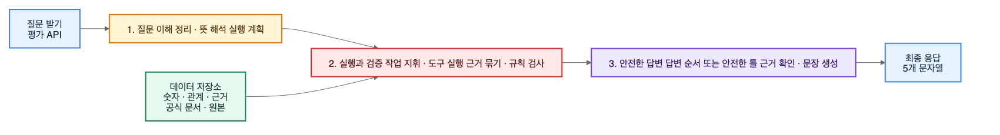
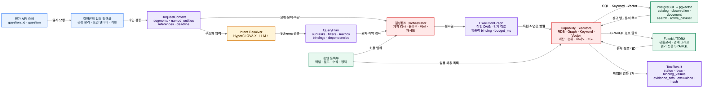
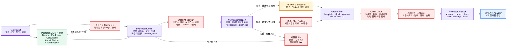
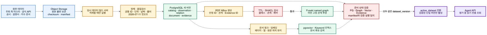
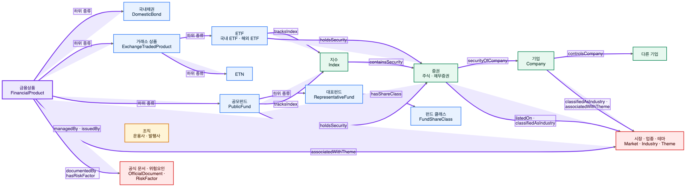

# 금융상품 분석 에이전트 아키텍처·온톨로지 설계 요약

> 작성 기준: 2026-08-18<br>
> 데이터 기준일: 2026-07-11<br>
> 문서 목적: 팀원이 현재 승인된 설계, 구현 상태, 다음 작업을 한 번에 이해하도록 정리한 공유용 문서

## 1. 한 문장 요약

이 시스템은 사용자의 금융상품 질문을 이해한 뒤, 필요한 데이터와 공식 문서를 찾아 계산하고, 모든 주장에 근거가 있는지 규칙으로 확인한 다음에만 답변을 내보내는 내부 분석 도우미다.

핵심 원칙은 다음 세 가지다.

1. 언어 모델은 질문을 이해하고 검증된 답변의 순서를 정하는 데만 사용한다.
2. 검색, 정렬, 순위, 비교, 금융 계산, 검증은 재현 가능한 프로그램이 수행한다.
3. 상품명·수치·날짜·단위·출처는 확인된 근거에서만 가져오며 언어 모델이 새로 만들 수 없다.

## 2. 최신 설계에서 달라진 점

초기의 다중 에이전트 구상은 현재 실행 계약이 아니다. 최신 설계에서는 국내채권, 국내 ETF, 해외 ETF, 공모펀드 담당 영역을 각각 별도 LLM 에이전트로 두지 않고, 데이터 매핑·검색 규칙·계산 규칙·온톨로지를 가진 **결정론적 Capability Module**로 둔다.

| 구분 | 과거 구상 | 현재 승인된 방향 |
|---|---|---|
| 도메인 전문가 | 상품군별 LLM 에이전트 | 상품군별 결정론적 Capability Module |
| 검증 | LLM 검증자 포함 | 규칙 기반 Verifier |
| 답변 생성 | LLM이 문장과 사실을 함께 작성 | LLM은 Claim ID와 답변 틀만 선택, Renderer가 사실 문자열 생성 |
| 정상 경로 LLM 호출 | 여러 에이전트 호출 가능 | 최대 2회 |
| 기본 데이터베이스 | 과거 DuckDB 중심 계획 | PostgreSQL + pgvector가 정규 수치·근거의 기준 저장소 |

따라서 과거의 `MULTI_AGENT_ARCHITECTURE.md`는 배경과 설계 변화 이력을 이해하는 자료로만 보고, 실제 구현은 런타임 계약과 최신 ADR을 기준으로 해야 한다.

### 2.1 기술 설계는 어디까지 확정됐나

기술적인 구조가 없었던 것은 아니다. 질문 처리, 계약 객체, 실행 DAG, 근거 원장, 답변 출시, 실패 처리, 저장소, NCP 배포는 이미 승인 문서에 나뉘어 정의되어 있다. 부족했던 것은 이 내용을 한 번에 이어 보여주는 상세 그림이었다.

| 영역 | 현재 수준 | 아직 남은 일 |
|---|---|---|
| 상위 런타임 구조 | 승인 완료 | 실제 컴포넌트 연결 구현 |
| 런타임 계약 | Pydantic 모델·JSON Schema·계약 간 호환 검사 구현 | Stage 01 종료 보강 후 필드 동결 |
| Stage 01 종료 보강 | strict ingress, canonical serialization, ClaimSupport 의미 제약, Schema mutation proof 설계 검토 완료 | 전용 구현 계획 승인, 구현·NCP 재검증 |
| 근거·검증·답변 출시 | 논리 구조와 불변식 승인 | PostgreSQL 원장, Verifier, Claim Gate, Renderer 구현 |
| 저장소·NCP 배포 | 저장소 역할·네트워크·초기 사양 승인 | 실제 프로비저닝과 부하 테스트 |
| 온톨로지 | 클래스·13개 관계·시간·근거 구조 승인 | TTL·SHACL 필드 매핑과 ABox 적재 |

즉, **논리 구조와 계약 경계는 설계되어 있지만 실제 서비스가 모두 연결된 상태는 아니다.** 특히 Stage 01 계약 필드가 아직 동결되지 않았으므로 PostgreSQL DDL과 런타임 구현은 그 이후 단계다.

## 3. 전체 아키텍처



편집·확대용 파일: [SVG](diagrams/financial-agent-runtime-architecture.svg) · [Excalidraw](diagrams/financial-agent-runtime-architecture.excalidraw) · [Mermaid 원본](diagrams/financial-agent-runtime-architecture.mmd)

위 그림은 비기술 구성원까지 함께 보는 요약도다. 아래 세부도부터는 실제 계약 객체와 데이터 이동을 표시한다.

### 3.1 상세도 A: 평가 질문에서 `ToolResult`까지



편집·확대용 파일: [SVG](diagrams/runtime-execution-dataflow-detail.svg) · [Excalidraw](diagrams/runtime-execution-dataflow-detail.excalidraw) · [Mermaid 원본](diagrams/runtime-execution-dataflow-detail.mmd)

실선 화살표는 질문이나 구조화 데이터의 이동을 나타낸다. `RequestContext`, `QueryPlan`, `ExecutionGraph`, `ToolResult`는 모두 스키마 검증을 거치는 불변 계약이다. Executor는 PostgreSQL과 Fuseki에 직접 자유 질의를 보내지 않고, 등록된 작업·필드·수식·정책 안에서만 실행한다.

### 3.2 상세도 B: 근거 원장에서 최종 API 응답까지



편집·확대용 파일: [SVG](diagrams/evidence-release-dataflow-detail.svg) · [Excalidraw](diagrams/evidence-release-dataflow-detail.excalidraw) · [Mermaid 원본](diagrams/evidence-release-dataflow-detail.mmd)

검색 결과는 바로 답변이 되지 않는다. 근거 원장과 결정론적 Claim 생성 규칙을 통과해 `EvidenceBundle`이 되고, Verifier가 출시 가능한 Claim ID만 허용한다. Answer Composer는 허용된 ID를 배치할 뿐이며 Claim Gate와 Renderer가 마지막 안전 경계를 담당한다.

### 3.3 질문 이해

1. 평가 API가 `question_id`와 질문을 받는다.
2. 입력을 정규화해 `RequestContext`를 만든다.
3. Intent Resolver가 질문의 의도, 대상 상품군, 필요한 지표와 관계를 해석한다.
4. 해석 결과를 스키마 검증된 `QueryPlan`으로 만든다.

이 구간의 LLM 호출은 최대 1회다. 출력 형식이 맞지 않을 때 사용할 수 있는 공용 LLM 복구 기회도 요청당 1회로 제한한다.

### 3.4 실행과 검증

Orchestrator는 `QueryPlan`을 실제 실행 순서와 의존 관계가 담긴 `ExecutionGraph`로 바꾼다. 이후 필요한 Capability만 선택해 가능한 작업은 병렬로 실행한다.

주요 Capability는 다음과 같다.

- 관계형 데이터 조회
- 지식 그래프 관계 탐색
- 키워드 검색과 벡터 검색
- 금융 계산
- 정렬과 순위 산정
- 유사 상품 탐색
- 여러 상품 비교

각 실행 결과는 `ToolResult`가 되고, 모든 결과와 출처는 근거 원장에 기록된다. 요청 시점에 사용할 근거만 묶은 읽기 전용 `EvidenceBundle`을 만든 뒤 Verifier가 계약, 출처, 날짜, 관계, 계산, 답변 범위를 정해진 순서로 검사한다.

### 3.5 안전한 답변 생성

검증을 통과한 경우에만 Answer Composer를 호출한다. 이 LLM은 문장을 직접 쓰지 않고 다음 항목만 담은 `AnswerPlan`을 만든다.

- 사용 가능한 Claim ID
- 등록된 답변 블록과 템플릿 ID
- 표의 열과 표시 순서
- 각 위치에 넣을 값의 슬롯 ID

근거가 부족해 제한 설명이나 답변 자제가 필요한 경우에는 LLM 대신 Safe Plan Builder가 안전한 `AnswerPlan`을 만든다. 이후 Claim Gate가 모든 Claim과 근거 연결을 마지막으로 확인하고, 결정론적 Renderer가 상품명·숫자·날짜·단위·출처가 포함된 최종 문자열을 생성한다.

정상 경로의 LLM 호출 수는 최대 2회다.

- 1회차: 질문의 뜻을 구조화
- 2회차: 검증된 Claim을 어떤 순서와 형식으로 보여줄지 선택

### 3.6 실제 질문 한 건이 흐르는 예

예시 질문은 다음과 같다.

> 삼성전자가 들어간 ETF를 AUM순으로 5개 알려줘. 이 상품들 중 1년 수익률이 가장 높은 상품과 비슷한 상품도 알려줘.

1. 입력 정규화기가 두 문장과 `삼성전자`, `ETF`, `AUM`, `1년 수익률`, `이 상품들`을 `RequestContext`에 기록한다.
2. Intent Resolver는 삼성전자 식별, 편입 ETF 탐색, AUM Top 5, 1년 수익률 1위, 유사 상품 탐색의 다섯 하위 작업을 `QueryPlan`에 만든다.
3. `s1.top5_products`와 `s2.top_return_product`를 중간 binding으로 선언하고 작업 의존 관계를 연결한다.
4. Orchestrator는 이를 엔티티 식별 → Graph 편입 관계 → PostgreSQL AUM·수익률 → 순위 → 유사도 계산 순서의 `ExecutionGraph`로 컴파일한다.
5. 독립 조회는 병렬 실행하고, 선행 결과가 필요한 작업은 실제 binding 값이 생긴 뒤 실행한다.
6. 각 작업은 결과 행, 안정 ID, 제외 사유, 근거 ID, 결과 해시가 담긴 `ToolResult`를 하나씩 반환한다.
7. Claim 생성 규칙은 보유 관계, AUM 값, 순위, 수익률, 유사도 Claim을 만들고 모든 입력과 계산 계보를 근거 원장에 연결한다.
8. Verifier가 데이터 버전, 기준일, 출처, 계산 모집단, 동률 규칙, 관계 근거를 검사한다.
9. Answer Composer는 통과한 Claim을 표와 설명 블록에 배치하고, Claim Gate와 Renderer가 최종 다섯 문자열을 만든다.

## 4. 런타임 계약

모든 단계는 자유 형식 텍스트가 아니라 명시적인 계약 객체로 연결된다.

| 계약 | 역할 |
|---|---|
| `RequestContext` | 원본 질문과 정규화된 요청 정보 |
| `QueryPlan` | 질문 의도, 필요한 작업, 중간 값 연결 규칙 |
| `ExecutionGraph` | 실행 작업, 의존 관계, 병렬 실행 가능 범위, 핵심 경로 |
| `ToolResult` | 도구 실행 결과, 실제로 만든 중간 값, 오류와 소요 시간 |
| `EvidenceBundle` | 이번 요청에서 답변에 사용할 수 있는 불변 근거 묶음 |
| `VerificationReport` | 검증 결과, 실패 이유, 허용할 답변 범위 |
| `AnswerPlan` | 사용할 Claim과 답변 형식만 지정한 설계도 |
| `ReleasedAnswer` | Claim Gate와 Renderer를 통과한 최종 응답 |

모든 계약에는 최소한 다음 추적 정보가 들어간다.

- `schema_version`
- `request_key`
- `run_id`
- `dataset_version`
- `cutoff_date`
- `producer`
- `created_at`

### 4.1 중간 값 연결 규칙

한 작업의 결과를 다음 작업이 사용해야 할 때는 binding으로 연결한다. 예를 들어 첫 작업이 운용사 ID를 찾고 두 번째 작업이 그 ID로 ETF를 조회한다면 다음 규칙을 지켜야 한다.

- 각 binding은 정확히 한 작업만 만든다.
- binding을 사용하는 작업은 만든 작업에 의존해야 한다.
- 단일 값인지 여러 값인지 cardinality가 일치해야 한다.
- 계획에 선언한 binding과 실제 `ToolResult`가 호환되어야 한다.

이 규칙으로 실행 순서가 바뀌거나 중간 결과가 잘못 연결되는 문제를 계약 단계에서 차단한다.

## 5. 근거 원장과 검증

PostgreSQL의 근거 원장은 답변의 모든 사실을 원출처까지 추적할 수 있게 만든다.

```text
최종 문장 또는 표의 한 칸
  → AtomicClaim
    → EvidenceRecord 또는 CalculationRecord
      → SourceRecord
        → 공식 원문 위치
```

주요 레코드는 다음과 같다.

- `SourceRecord`: 공식 문서, 데이터 파일, API 등 원출처
- `EvidenceRecord`: 원출처에서 가져온 특정 사실
- `CalculationRecord`: 입력값과 계산식이 남은 파생 결과
- `AtomicClaim`: 답변에 사용할 수 있는 최소 단위 주장
- `ClaimSupport`: Claim과 근거 또는 계산의 연결

Claim 유형은 직접 사실, 관계, 파생 지표, 순위, 유사도, 검색 결과 없음, 데이터 한계, 정책 경계로 구분한다.

Verifier는 다음 순서로 검사한다.

1. 계약과 스키마 버전
2. 출처와 출처 권한
3. 공개일·적용일·기준일
4. 온톨로지 타입과 관계
5. 계산식과 비교 가능성
6. 근거 범위와 답변 정책

같은 근거 원장에서 `answer`, `retrieved_context`, `think_trace`를 만들기 때문에 사용자에게 보이는 답변과 내부 추적 정보가 서로 달라지는 일을 줄인다.

## 6. 실패와 답변 정책

실행 성공 여부, 검증 결과, 사용자에게 보여줄 답변 형태를 서로 다른 축으로 관리한다.

| 축 | 값 | 의미 |
|---|---|---|
| `ExecutionOutcome` | `completed`, `completed_with_failures`, `failed` | 필요한 작업이 어느 정도 실행됐는가 |
| `VerificationStatus` | `pass`, `fail` | 결과가 검증 규칙을 통과했는가 |
| `AnswerDisposition` | `answer`, `partial`, `limitation`, `abstain` | 어떤 형태의 답변을 내보낼 것인가 |

검색을 정상적으로 끝냈는데 결과가 0개라면 실행 실패가 아니라 완전한 `answer`가 될 수 있다. 다만 지식 그래프에서 관계를 찾지 못했다는 사실만으로 “그 관계가 없다”고 단정하지 않는다. 닫힌 탐색 범위가 명시되어 있고 그 범위를 빠짐없이 검사했다는 증거가 있을 때만 부재를 주장할 수 있다.

HTTP 상태는 다음처럼 사용한다.

- `200`: 답변, 부분 답변, 데이터 한계 설명, 답변 자제
- `503`: 중요한 외부 의존성이 재시도 후에도 일시적으로 실패
- `504`: 내부 처리 기한 초과
- `500`: 계약 불변 조건 위반이 복구 후에도 반복

평가 모드에서는 추가 질문을 받을 수 없으므로, 모호한 질문은 승인된 기본값 사용, 제한된 대안 병기, 서로 맞지 않는 지표 분리, 데이터 한계 설명, 답변 자제 중 하나로 처리한다.

## 7. 데이터·배포 구조

### 7.1 상세 데이터 적재·버전 활성화 흐름



편집·확대용 파일: [SVG](diagrams/offline-data-pipeline-detail.svg) · [Excalidraw](diagrams/offline-data-pipeline-detail.excalidraw) · [Mermaid 원본](diagrams/offline-data-pipeline-detail.mmd)

이 흐름은 온라인 질문 처리와 분리된 오프라인 빌드 경로다. PostgreSQL, Fuseki, Vector, Evidence가 같은 `dataset_version`과 manifest를 가리키고 검증 실행을 통과해야만 `active_dataset`을 전환한다. 한 저장소만 새 버전으로 바뀐 중간 상태는 API가 사용할 수 없다.

### 7.2 물리 저장소

| 저장소 | 담당 데이터 |
|---|---|
| Object Storage | 원본 파일, 공식 문서, 적재 manifest, 백업 |
| PostgreSQL + pgvector | 정규화된 상품·수치·관계 원본, 검색 인덱스, 근거 원장, 운영 기록 |
| Apache Jena Fuseki/TDB2 | 온톨로지와 RDF 관계 그래프의 조회용 투영 |
| Agent API | 질문 수신, 실행 제어, 검증, 응답 반환 |

PostgreSQL은 정규 수치와 근거의 기준 저장소다. Fuseki는 관계 탐색을 위한 투영이며, 가격·수익률·수수료 같은 변하는 숫자의 기준 저장소가 아니다.

### 7.3 논리 데이터 계층

1. Source Layer: 받은 원본을 변경하지 않고 보관
2. Normalized Layer: 상품, 기관, 시계열 수치, 문서를 공통 형식으로 정규화
3. Semantic Layer: ID 연결, 상품 분류, 온톨로지 관계 구성
4. Retrieval Layer: SQL, 그래프, 키워드, 벡터 검색 제공
5. Evidence & Release Layer: 근거 원장, 검증, Claim Gate, Renderer

PostgreSQL 내부는 `catalog`, `observation`, `relation`, `document`, `search`, `evidence`, `operations` 스키마로 나눈다.

### 7.4 NCP 배포 기준

외부 요청은 Public ALB를 거쳐 두 대의 무상태 API 서버로 들어간다. API 서버는 private network의 PostgreSQL HA, 읽기 전용 Fuseki, Object Storage를 사용한다. 대량 적재와 그래프 생성은 임시 build server에서 수행하고, 온라인 API 서버는 요청 처리에 집중한다.

외부 요청은 순차 처리하며 제한 시간은 300초다. timeout 또는 5xx 뒤 최대 2회 재시도할 수 있다. 내부 hard deadline은 55초이며 50초 이후에는 새 작업을 시작하지 않고 마지막 5초를 응답 전송에 남긴다. 초기 p95 목표는 단순 조회 4초, 단일 상품군 7초, 상품군 간 비교 10초다.

## 8. 금융상품 온톨로지

온톨로지는 금융상품, 기관, 지수, 종목, 기업, 시장, 업종, 테마, 문서가 어떤 종류이고 서로 어떻게 연결되는지를 공통 언어로 정의한 관계 지도다.



편집·확대용 파일: [SVG](diagrams/financial-product-ontology.svg) · [Excalidraw](diagrams/financial-product-ontology.excalidraw) · [Mermaid 원본](diagrams/financial-product-ontology.mmd)

### 8.1 핵심 클래스 계층

```text
FinancialProduct
├─ DomesticBond
├─ ExchangeTradedProduct
│  ├─ ETF
│  │  ├─ DomesticETF
│  │  └─ OverseasETF
│  └─ ETN
└─ PublicFund
   ├─ RepresentativeFund
   └─ FundShareClass

Organization
├─ AssetManager
├─ Issuer
└─ Company

Security
├─ EquitySecurity
└─ DebtSecurity

Index · Theme · Industry · Market · Region · AssetClass · RiskGrade
OfficialDocument · DocumentChunk · RiskFactor · RelationAssertion
```

대표펀드와 펀드 클래스는 같은 상품을 중복 등록한 것이 아니다. 대표펀드는 공통 운용 전략을 나타내고, 펀드 클래스는 수수료·판매 채널 등 가입 조건이 다른 실제 선택 단위다.

### 8.2 표준 관계 13개

| 관계 | 출발 | 도착 | 의미 |
|---|---|---|---|
| `managedBy` | 금융상품 | 자산운용사 | 상품을 운용하는 기관 |
| `issuedBy` | 금융상품·증권 | 발행사 | 상품 또는 증권을 발행한 기관 |
| `tracksIndex` | ETF·공모펀드 | 지수 | 추종하는 기준 지수 |
| `holdsSecurity` | ETF·공모펀드 | 증권 | 편입한 주식·채무증권 |
| `containsSecurity` | 지수 | 증권 | 지수를 구성하는 종목 |
| `securityOfCompany` | 주식형 증권 | 기업 | 해당 증권의 기업 |
| `controlsCompany` | 기업 | 기업 | 기업 지배 관계 |
| `listedOn` | 증권 | 시장 | 상장된 시장 |
| `classifiedAsIndustry` | 기업·증권 | 업종 | 산업 분류 |
| `associatedWithTheme` | 금융상품·지수·기업 | 테마 | 관련 투자 테마 |
| `hasShareClass` | 대표펀드 | 펀드 클래스 | 대표펀드에 속한 가입 클래스 |
| `documentedBy` | 금융상품·기관 | 공식 문서 | 상품이나 기관을 설명하는 공식 문서 |
| `hasRiskFactor` | 금융상품 | 위험요인 | 상품에 적용되는 위험 요소 |

### 8.3 관계의 시간과 근거

보유 종목, 지수 구성, 테마 연결, 기업 지배 관계는 시간이 지나면 바뀔 수 있다. 따라서 관계를 단순한 선 하나로만 저장하지 않고 `RelationAssertion`으로 관리한다.

필수 정보는 다음과 같다.

- subject, predicate, object
- 관계의 강도 또는 비중인 `weight`
- 유효 기간 `valid_from`, `valid_to`
- 문서 공개일 `published_at`
- 시스템에서 사용할 수 있게 된 시점 `available_at`
- `relation_assertion_id`
- `evidence_id`
- `dataset_version`

기준일은 2026-07-11로 고정하되 실제 적용일은 별도로 보존한다. 기준일 이후 공개되거나 수정된 정보는 평가 답변 근거에서 제외한다.

### 8.4 숫자 데이터와 온톨로지의 경계

온톨로지는 “무엇이 무엇과 어떤 관계인가”를 담당한다. 실제 가격, 수익률, 수수료, 잔고, 보유 비중처럼 자주 변하는 값은 PostgreSQL의 observation 영역에 저장한다.

`Currency`, `ReturnMetric`, `FeeMetric`, `AvailabilityStatus`는 값의 뜻을 맞추기 위한 공통 어휘로만 정의한다. 실제 숫자는 날짜·단위·출처가 함께 있는 관측 레코드가 권위 원본이다.

### 8.5 예정된 온톨로지 파일 구조

```text
ontology/
├─ common.ttl
├─ bond_kr.ttl
├─ etf_kr.ttl
├─ etf_gl.ttl
├─ fund_pub.ttl
└─ shapes/
   ├─ common.shacl.ttl
   └─ domain.shacl.ttl
```

TTL은 클래스와 관계를 표현하고, SHACL은 잘못된 타입·누락된 필드·허용되지 않은 연결을 검증한다. 구체적인 TTL/SHACL 매핑과 실제 인스턴스 데이터 적재는 아직 남은 작업이다.

## 9. 도메인별 Capability Module

| 모듈 | 책임 |
|---|---|
| 국내채권 | 발행, 만기, 신용등급, 가격·수익률, 최신성 규칙 |
| 국내 ETF | 상품, 운용사, 지수, 보유 종목, NAV·가격·성과 |
| 해외 ETF | 해외 상품·시장·통화, 보유 종목, 지수, 환율과 비교 기준 |
| 공모펀드 | 대표펀드·클래스, 판매 조건, 수수료, 성과, 운용 기관 |

각 모듈은 같은 런타임 계약을 사용한다. 공통 Orchestrator가 모듈을 조합하므로 상품군 간 비교도 하나의 `ExecutionGraph` 안에서 처리할 수 있다.

## 10. 우선 확보해야 할 데이터

### P0: 답변 품질에 바로 필요한 데이터

- ETF 보유 종목과 비중
- 종목·기업·기관의 공통 ID
- 같은 기준일의 가격, NAV, 성과
- 공식 상품 설명서, 정책 문서, 위험 문서
- 시간에 따라 바뀌는 상품·테마·업종 관계
- 기업 지배, 상장 시장, 업종 분류

### P1: 다음 단계 확장 데이터

- 수수료와 분배금
- 기초지수와 지수 구성 종목
- 공식 환율
- 공모펀드 기관·클래스·판매 정보
- 채권 발행, 신용등급, 최신성 정보

## 11. 현재 구현 상태와 남은 작업

### 완료 또는 기준선이 확정된 항목

- 핵심 평가 질문 52개와 데이터 공백 정리
- ADR-0005~0007 승인
- 핵심 Pydantic 계약과 JSON Schema 구현
- Answer Composer가 사실 문자열을 직접 만들지 못하게 하는 `AnswerPlan` 경계 구현
- `ExecutionTask`의 `subtask_id`, `produces_bindings` 및 binding·핵심 경로 호환 규칙 구현
- Linux/amd64 계약 검증 컨테이너 구성
- 2026-08-18 호스트 재검증에서 116개 계약 테스트와 Schema 최신성 검사 통과
- Stage 01 종료 보강 5개 공백을 strict ingress, canonical serialization, ClaimSupport 의미 제약, Schema 경계·mutation proof의 네 구현 묶음으로 해결하는 승인 설계 작성

### 아직 진행해야 할 항목

1. Stage 01 Closure Hardening 전용 구현 계획 승인
2. strict ingress, canonical serialization, ClaimSupport 제약, Schema mutation proof 구현·검증
3. Stage 01 필드·Schema 동결
4. PostgreSQL DDL과 저장 계층 구현
5. 공식 데이터 적재 파이프라인과 기준일 필터
6. TTL·SHACL·ABox 생성 및 Fuseki 투영
7. SQL·그래프·문서·벡터를 묶는 통합 검색
8. 실제 Intent Resolver, Orchestrator, Executor, Verifier 구현
9. Claim Gate와 Renderer 구현
10. `GET /answer` API와 NCP 배포

Stage 02의 PostgreSQL 작업은 Stage 01 계약 필드가 동결된 뒤 시작하는 것이 현재 순서다.

## 12. 팀 작업 시 지켜야 할 기준

- 구현 전에 최신 `HARNESS.md`, 승인 ADR, 현재 task plan을 확인한다.
- 원본 데이터는 수정하지 않고 별도 계층에서 정규화한다.
- 계산과 순위는 LLM이 아니라 테스트 가능한 코드로 만든다.
- 모든 최종 Claim은 근거 또는 계산 기록까지 연결한다.
- 기준일 이후 정보가 섞이지 않도록 공개일과 적용일을 모두 검사한다.
- 과거 설계 문서와 현재 계약이 충돌하면 현재 승인 ADR과 런타임 계약을 우선한다.
- 새 설계 결정은 기존 ADR을 덮어쓰지 말고 새 ADR로 변경 이력을 남긴다.

## 13. 관련 원문 문서

- [프로젝트 상태](../planning/STATUS.md)
- [계획·의사결정 Harness](../planning/HARNESS.md)
- [런타임 계약](../planning/architecture/RUNTIME_CONTRACTS.md)
- [Stage 01 Closure Hardening 승인 설계](../planning/specs/2026-08-18-stage-01-closure-hardening-design.md)
- [금융 온톨로지 아키텍처](../planning/architecture/FINANCIAL_ONTOLOGY_ARCHITECTURE.md)
- [근거·검증·렌더링](../planning/architecture/EVIDENCE_VERIFICATION_AND_RENDERING.md)
- [실패와 답변 정책](../planning/architecture/FAILURE_AND_DISPOSITION_POLICY.md)
- [NCP 배포 아키텍처](../planning/architecture/NCP_DEPLOYMENT_ARCHITECTURE.md)
- [핵심 평가 질문](../planning/specs/core-evaluation-set.md)
- [공식 데이터 요구사항](../planning/specs/authoritative-data-requirements.md)
- [평가 API 규격](../reference/official-evaluation-api.md)
